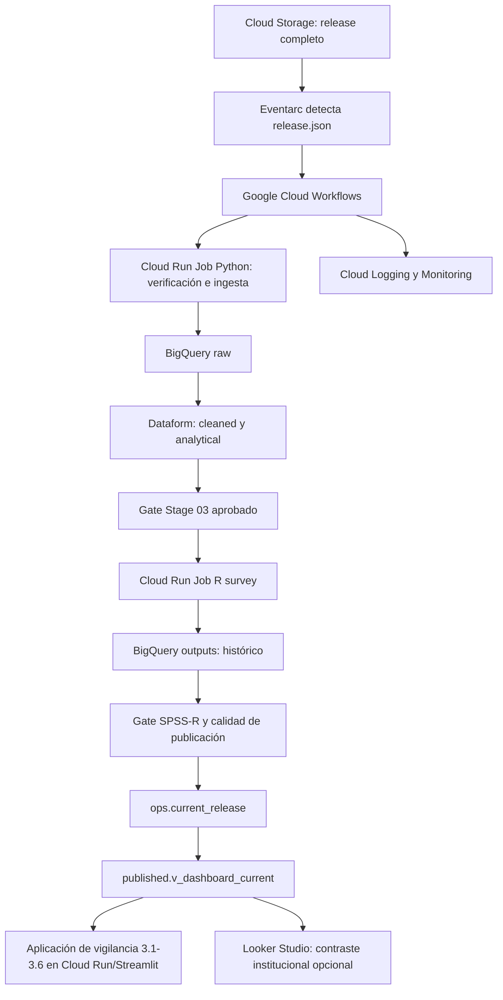

# ENARES 2024 CRS04 - Stage 04

## Paso a paso operativo para una aplicación cloud de vigilancia de la violencia contra NNA

**Versión 6 reorganizada - CSV/R V0 -> Stage 03 Cloud -> publicación agregada -> aplicación de vigilancia -> automatización**
**Fecha de reorganización:** 2026-08-17
**Actualización del paquete de inicio:** 2026-08-24
**Responsable de desarrollo:** Ana Cordero
**Estado:** propuesta corregida para implementación y revisión supervisora

## Paquete mínimo de inicio de Stage 04

**Precondición:** antes de usar este documento, completar
[`PRE_STAGE04.md`](PRE_STAGE04.md) y registrar una decisión
`READY_FOR_STAGE04_SHADOW`. El pre-stage prepara el repositorio, confirma los gates de Stage 03,
resuelve los números reales de GitHub y evita iniciar código desde un fork, una branch antigua o
un entorno sin revisión/coste autorizado.

Ana inicia Stage 04 con **cuatro archivos complementarios: tres Markdown y un test Python**. El
razonamiento estadístico ya está incorporado en este documento rector; no constituye otro
sprint ni un cuarto Markdown:

| Orden | Documento | Función | Cuándo se usa |
|---:|---|---|---|
| 1 | [`CRS04_STAGE04_CORREGIDO_VER6_NUEVA_METODOLOGIA.md`](CRS04_STAGE04_CORREGIDO_VER6_NUEVA_METODOLOGIA.md) | Documento rector: alcance, razonamiento estadístico, pasos, tres sprints, issues, gates y cierre | Durante todo Stage 04 |
| 2 | [`CRS04_STAGE04_HOJA_ARQUITECTONICA_APP_VIGILANCIA.md`](CRS04_STAGE04_HOJA_ARQUITECTONICA_APP_VIGILANCIA.md) | Diseño técnico de la aplicación, contratos, componentes, seguridad, pruebas y despliegue | Al diseñar o revisar arquitectura y app |
| 3 | [`NAMING_CONVENTIONS.md`](NAMING_CONVENTIONS.md) | Convenciones para rutas, módulos 3.1-3.6, releases, corridas, BigQuery, Dataform, branches y evidencia | Antes de crear archivos o recursos nuevos |
| 4 | [`test_naming.py`](tests/test_naming.py) | Control automático que verifica las convenciones del tercer archivo | Después de crear o renombrar la estructura y antes de aprobar el PR |

El cuarto archivo no es un documento metodológico. En esta carpeta se conserva como
`test_naming.py`; al incorporarlo al repositorio debe ubicarse en `tests/test_naming.py` y
ejecutarse con `pytest tests/test_naming.py -q`.

`CRS04_Stage04_CORREGIDO_ver5.md`, `CRS04_STAGE04_VERSION_0_REGISTRO.md`, los CSV y los
scripts R son antecedentes y evidencia V0. Se preservan para trazabilidad, pero Ana no debe
seguir simultáneamente la planificación de la versión 5 y la versión 6.

### Puerta documental antes de programar

- [ ] Ana revisó la función de los cuatro archivos y puede explicar cuál responde a cada
  pregunta: **qué hacer e interpretar estadísticamente**, **cómo se organiza la app**,
  **cómo nombrar** y **cómo verificar automáticamente los nombres**.
- [ ] El cierre de Stage 03 está aprobado para el `release_id` que ingresará a Stage 04.
- [ ] Los nuevos nombres propuestos cumplen `NAMING_CONVENTIONS.md` y
  `pytest tests/test_naming.py -q` pasa en verde.
- [ ] El primer ejercicio se limita al corte vertical de 3.2; todavía no se replica código a
  los seis módulos.

**Condición de parada:** si falta el gate de Stage 03, no se conoce el archivo V0 de referencia
o las convenciones no pasan el test, Ana prepara la evidencia faltante y solicita supervisión;
no carga resultados, crea recursos con coste ni inicia la aplicación completa.

## Perfil formativo y método de acompañamiento

Ana es estudiante de **Computer Science and Artificial Intelligence en University of Sussex** y ha terminado su primer año. Stage 04 se plantea como una experiencia guiada de software, datos y cloud.

Cada actividad debe seguir el patrón:

```text
Concepto breve
  -> demostración del supervisor o ejemplo resuelto
  -> plantilla ejecutable
  -> cambio pequeño realizado por Ana
  -> prueba de éxito y fallo
  -> explicación de Ana
  -> evidencia y revisión
```

Ana puede ejecutar, adaptar, probar y documentar. La supervisión conserva la aprobación de metodología, pesos, tolerancias, IAM, facturación, despliegues con coste, publicación y cutover.

### Conocimientos que se enseñan en Stage 04

- diferencia entre tabla histórica, vista publicada y puntero de release;
- contenedores y Cloud Run Jobs;
- configuración e IAM de mínimo privilegio;
- logs, estados, reintentos y rollback;
- CI/CD básico con Cloud Build;
- conexión segura de Looker Studio y Streamlit;
- diseño de una aplicación de vigilancia poblacional por módulos 3.1-3.6;
- traducción de una referencia UX existente a un producto seguro para violencia contra NNA;
- evaluación de herramientas avanzadas sin obligación de adoptarlas.

No se exige que Ana diseñe sola infraestructura productiva, políticas de seguridad o recuperación ante desastres. Debe participar, comprender las decisiones y demostrar lo aprendido.

> Los scripts R y los CSV que ya contienen los indicadores de los módulos 3.1-3.6 y sus desagregaciones se reconocen como **Versión 0 (V0), baseline funcional construida por Ana**. `CRS04_Stage04_CORREGIDO_ver5` y sus antecedentes forman parte de la documentación de esa baseline. Esta versión 6 reorganizada no borra ni invalida el trabajo: V0 permanece documentada y ejecutable; V0.5 carga y publica resultados en modo shadow; y cada componente solo pasa a V1 después de demostrar paridad metodológica, técnica y visual.

## 1. Objetivo

Construir una **aplicación cloud de vigilancia poblacional de la violencia contra niñas, niños y adolescentes**, inspirada en la experiencia de navegación de la aplicación de vigilancia infantil tomada como referencia, pero adaptada a ENARES y sin expedientes individuales. La aplicación consume exclusivamente resultados agregados, aprobados y versionados; organiza el contenido en los módulos 3.1-3.6; ofrece las desagregaciones clave; conserva el historial por release y nunca consulta microdatos.

El orden de trabajo parte del estado real de Ana:

```text
Indicadores ya calculados con R y guardados en CSV (V0)
  -> Sprint Cloud de Stage 03
  -> gate Stage 03 aprobado
  -> registro y validación de los CSV/R V0
  -> carga shadow en BigQuery outputs
  -> vista agregada published
  -> aplicación de vigilancia por módulos 3.1-3.6
  -> comparación visual y metodológica con V0
  -> automatización con Cloud Run y Workflows
```

Stage 04 debe poder responder:

- qué versión de datos fue procesada;
- qué commit y contenedor produjeron los resultados;
- qué validaciones pasaron o fallaron;
- qué release está vigente;
- cómo revertir la publicación sin borrar el historial.
- qué módulo, indicador y desagregación está viendo el usuario;
- por qué un resultado es publicable, referencial o suprimido;
- cómo se demuestra que la aplicación muestra exactamente el resultado aprobado en CSV/R.

## 2. La Versión 0 y la evolución propuesta

### 2.1 Qué integra la V0

La V0 comprende el trabajo ya realizado por Ana:

- scripts R que calculan las estimaciones de encuesta compleja;
- CSV de resultados para los módulos 3.1-3.6 y las desagregaciones aprobadas;
- tablas y anexos usados para validar porcentajes, errores estándar, IC95 %, CV y N no ponderado;
- documentos `CRS04_Stage04_CORREGIDO_ver5` y antecedentes;
- notebooks ejecutados desde VS Code/Jupyter;
- flujo de reconstrucción asociado al Sandbox;
- archivos y respaldos operativos conservados en Google Drive;
- tablas `reporting/current`, `update_log` y consultas existentes;
- prototipos o pruebas previas de Looker Studio/Streamlit, cuando existan;
- issues, correcciones de supervisión y evidencia académica acumulada.

La V0 se conserva como baseline, oráculo de regresión y contingencia. No debe calificarse como trabajo equivocado: resolvió restricciones reales del entorno disponible.

### 2.2 Etapas de migración

| Etapa | Función | Condición de promoción |
|---|---|---|
| **V0 - baseline funcional** | Scripts R + CSV con indicadores 3.1-3.6 y desagregaciones | Se registra con hashes, diccionario, escala, release y resultados de referencia |
| **V0.5 - aplicación candidata** | CSV/R V0 cargado en `outputs`, vista `published` y aplicación en shadow | Debe reproducir los valores V0 y no exponer microdatos |
| **V1 - arquitectura objetivo** | Cálculo R automatizado, Cloud Run, Workflows, outputs/published/ops y aplicación versionada | Paridad aprobada, pruebas, runbook, rollback y decisión formal de promoción |

### 2.3 Evolución de componentes

| Componente V0 | Componente candidato V0.5/V1 | Tratamiento durante la transición |
|---|---|---|
| BigQuery Sandbox con reconstrucción cada 50-55 días | Proyecto con facturación/política de expiración revisada | Mantener el refresh V0 hasta comprobar persistencia y recuperación V1 |
| Google Drive como repositorio operativo | Cloud Storage como repositorio oficial | Copiar y verificar hashes; no borrar Drive al realizar la primera migración |
| Notebooks/ejecución manual | Cloud Run Jobs | Conservar notebooks; extraer un job piloto y ejecutar ambos sobre el mismo release |
| CSV/R con resultados validados | `outputs.indicator_estimates` histórico | Cargar primero en shadow, conservar hash del CSV y comprobar fila por fila antes de automatizar el cálculo |
| `reporting/current` como copias sucesivas | `outputs.indicator_estimates` + `published.v_dashboard_current` | Carga shadow; la vista V1 no es oficial hasta aprobar paridad |
| Tablas/anexos separados por módulo | Aplicación con navegación 3.1-3.6 | Mantener la misma definición, universo, denominador y regla de calidad en cada pantalla |
| `update_log` | tablas `ops` especializadas | Escribir en ambos registros durante la prueba y reconciliar eventos |
| reemplazo de current | histórico + promoción por puntero | Probar rollback antes de cambiar la fuente oficial |
| staging permanente | staging temporal cuando sea necesario | Retirar solo después de confirmar que ningún notebook V0 depende de esa capa |
| refresh por calendario | disparador por release o código | Desactivar el calendario únicamente después del cutover V1 |

## 3. Regla metodológica

```text
Stage 04 V0 y V1 no crean ni corrigen indicadores de microdatos.
Stage 03 entrega para shadow la tabla aprobada
enares2024_crs04_outputs.reporting_crs04_survey_input_v0_5.
Stage 04 registra V0 -> valida -> publica agregados -> construye la app -> automatiza.
```

Si falta un indicador, un peso, una PSU, un estrato o una desagregación, Stage 04 no lo reconstruye. Registra el fallo y devuelve el requerimiento a Stage 03. La aplicación tampoco completa valores ausentes, recalcula prevalencias ni crea combinaciones no aprobadas.

## 3.1 Arquitectura productiva inicial aprobada para ENARES

La primera versión productiva no debe desplegar todas las herramientas estudiadas. Para el volumen y frecuencia actuales de CRS04 se adopta esta arquitectura mínima:

```text
Cloud Storage buckets
  -> Eventarc / Workflows
  -> Cloud Run Jobs Python
  -> BigQuery / Dataform
  -> Cloud Run Job R survey
  -> BigQuery outputs / ops / published
  -> Aplicación de vigilancia en Cloud Run/Streamlit
  -> Looker Studio para contraste institucional opcional
```

| Herramienta | Decisión inicial | Justificación |
|---|---|---|
| Cloud Storage buckets | **PRODUCCIÓN** | Releases, manifests, hashes, artefactos y recuperación |
| BigQuery + Dataform | **PRODUCCIÓN** | Transformaciones, contratos, dependencias y assertions |
| Cloud Run Jobs | **PRODUCCIÓN** | Adecuado para procesos batch pequeños y contenedores Python/R |
| Workflows | **PRODUCCIÓN INICIAL** | Suficiente para un pipeline corto, infrecuente y con dependencias claras |
| Kubernetes/GKE | **LABORATORIO/PILOTO** | Aporta aprendizaje y control, pero añade complejidad innecesaria al MVP |
| Apache Airflow/Managed Airflow | **SHADOW/ADR** | Útil para DAGs complejos y backfills; no se justifica todavía como segundo orquestador |
| Vertex AI Agent Engine | **PILOTO READ-ONLY** | Puede explicar `ops` y `published`; no interviene en metodología o publicación |

La ausencia de Kubernetes, Airflow o agentes en producción no se considera una carencia. La decisión de no adoptarlos puede ser el resultado correcto de la evaluación técnica.

## 4. Arquitectura objetivo



Stage 04 comienza operativamente en el **gate aprobado de Stage 03**. La ingesta y Dataform aparecen en el diagrama para mostrar el flujo completo, no para autorizar que Stage 04 repita las tareas de Stage 01-03.

## 5. Productos

### 5.1 Producto principal: aplicación de vigilancia de la violencia contra NNA

Aplicación web desplegada inicialmente con Streamlit en Cloud Run, o tecnología equivalente aprobada. Puede inspirarse en la organización visual de la aplicación construida por el hermano de Ana —filtros, tarjetas, pestañas, alertas y resumen imprimible—, pero no copia su unidad individual ni su lógica clínica.

La especificación técnica de construcción se encuentra en [`CRS04_STAGE04_HOJA_ARQUITECTONICA_APP_VIGILANCIA.md`](CRS04_STAGE04_HOJA_ARQUITECTONICA_APP_VIGILANCIA.md).

#### Resultado final esperado y enlace de la aplicación

Stage 04 no se considera terminada con notebooks, tablas, documentación, capturas o un
wireframe estático. El producto final es una aplicación funcional desplegada en Google Cloud
Run, con una URL `https://<servicio>-<identificador>-<region>.a.run.app` y una interfaz
equivalente funcionalmente a la maqueta ENARES suministrada: filtros, tarjetas 3.1-3.6,
resumen, estimaciones, IC95 %, CV, N, calidad, alertas, ficha metodológica, historial y
exportación agregada.

La maqueta es la referencia UX y usa datos sintéticos o ilustrativos. Su URL no sustituye el
despliegue real de Ana. La aplicación `run.app` debe consumir el release agregado aprobado y
nunca reconstruir indicadores dentro de la interfaz.

Después del primer despliegue, el enlace se registra en:

1. el README principal del repositorio;
2. el campo **Website** de la sección **About** de GitHub;
3. el pull request de despliegue, junto con commit, digest, `release_id`, `run_id` y estado;
4. la GitHub Release correspondiente, cuando exista una versión aprobada.

Mientras esté en validación, el enlace se etiqueta claramente como `DEMO` o `SHADOW`:

```md
## Aplicación de vigilancia

[Abrir aplicación ENARES CRS04](https://<servicio>.a.run.app)

Estado: `SHADOW`
Datos: resultados agregados en validación; no constituye publicación oficial de INEI o UNICEF.
```

Solo puede etiquetarse como `APPROVED` o presentarse como release vigente después de aprobar
paridad, privacidad, módulos, desagregaciones, rollback y autorización supervisora. La
publicación del enlace no equivale por sí sola a autorización institucional ni a reemplazo de
V0.

La unidad visible es siempre un **indicador poblacional agregado**. No existen listas de niñas, niños o adolescentes, búsqueda por ID, expedientes personales, fechas de nacimiento ni alertas nominales.

La aplicación consulta únicamente `published.v_dashboard_current` o vistas publicadas equivalentes. No recalcula prevalencias, no consulta microdatos y no accede a `raw`, `cleaned`, `analytical`, `survey_input` ni staging.

El alcance inicial es **CRS04: adolescentes de 12 a 17 años**. Si posteriormente se incorpora CRS03 (9 a 11 años), se publica como población y corrida separadas; no se crea un total combinado 9-17 ni se presentan las encuestas como seguimiento longitudinal sin una decisión metodológica explícita.

### 5.2 Navegación funcional por módulos

| Módulo | Página principal | Contenido esperado |
|---|---|---|
| **3.1** | Características, percepciones y normas | percepciones, roles, rechazo/aceptación de normas y mitos aprobados |
| **3.2** | Violencia en el hogar | prevalencias, formas, periodos y agresores autorizados |
| **3.3** | Violencia en la escuela | prevalencias, formas, periodos y agresores autorizados |
| **3.4** | Violencia sexual | indicadores aprobados, universos específicos y advertencias de precisión |
| **3.5** | Polivictimización y acumulación | número de violencias, intersecciones y categorías aprobadas |
| **3.6** | Búsqueda de ayuda | búsqueda, ayuda recibida, brecha de ayuda y fuentes de apoyo |

Cada módulo contiene, cuando corresponda: resumen, prevalencias, formas/agresores, desagregaciones, calidad de estimación, ficha metodológica e historial de releases.

### 5.3 Desagregaciones globales

- Nacional;
- Sexo;
- Área;
- Área × sexo;
- Idioma del hogar;
- Discapacidad;
- Etnicidad;
- Tipo de hogar;
- Departamento.

No todas las desagregaciones se habilitan para todos los indicadores. La aplicación lee del contrato qué combinaciones están autorizadas y oculta o etiqueta resultados referenciales/suprimidos según CV, N y sensibilidad.

### 5.4 Looker Studio como contraste institucional

Looker Studio puede mantenerse como consumidor secundario para supervisión, comparación y necesidades institucionales. Consume la misma capa `published` que la aplicación y debe mostrar los mismos valores. No es obligatorio duplicar toda la experiencia de usuario de la aplicación.

### 5.5 Monitoreo

Cloud Logging y Cloud Monitoring son suficientes para la primera versión. Grafana puede evaluarse después para observabilidad técnica, pero no reemplaza el dashboard epidemiológico ni debe duplicar sus páginas.

## 6. Datasets BigQuery

```text
enares2024_crs04_raw
enares2024_crs04_cleaned
enares2024_crs04_analytical
enares2024_crs04_outputs
enares2024_crs04_published
enares2024_crs04_ops
```

Responsabilidades:

- `raw`: fuentes preservadas sin transformaciones analíticas;
- `cleaned`: tipos, estructura, llaves, merges y colisiones;
- `analytical`: indicadores, desagregaciones y variables de diseño;
- `outputs`: contrato físico V0.5 entregado por Stage 03 y estimaciones históricas por
  release y corrida;
- `published`: vistas estables y seguras para consumo;
- `ops`: registro de releases, corridas, validaciones y promoción.

No se crea un dataset `reporting` como copia adicional si `outputs` y `published` cubren el contrato. Staging solo se usa como tabla temporal cuando una carga necesita validación previa a promoción.

## 7. Contratos de entrada y salida

### 7.1 Entrada obligatoria desde Stage 03

La entrada física vigente y aprobada para desarrollo shadow es:

```text
enares2024_crs04_outputs.reporting_crs04_survey_input_v0_5
```

Contiene 18,807 filas y una proyección explícita de 737 columnas:

- identificadores técnicos requeridos por el diseño;
- estrato y conglomerados aprobados;
- peso oficial validado;
- el catálogo aprobado de indicadores de los módulos 3.1-3.6;
- desagregaciones autorizadas;
- `release_id`, `run_id` y linaje del Stage 03.

La tabla es una entrada restringida del Cloud Run Job R; no es fuente de la aplicación ni se
expone mediante `BigQueryRepository`. La aplicación lee únicamente
`enares2024_crs04_published.v_dashboard_current`.

La existencia de una columna no prueba su validez. El cierre de Stage 03 debe adjuntar dominios, missing, diccionario y reporte de diseño.

Además, Stage 04 registra como baseline los CSV/R V0 mediante un manifest que incluye:

```text
source_file
source_sha256
module_id
release_id
r_script_version
scale_0_1_or_0_100
row_count
generated_at_utc
validation_status
```

Los CSV no se cargan por nombre o apariencia. Primero se confirma su escala, columnas, etiquetas, cobertura de módulos, desagregaciones y correspondencia con el diccionario.

### 7.2 Tabla histórica de resultados

Tabla canónica: `enares2024_crs04_outputs.indicator_estimates`.

Campos mínimos:

```text
release_id STRING
run_id STRING
source_version STRING
source_hash STRING
git_commit_sha STRING
container_image_digest STRING
dataform_release STRING
indicator_id STRING
indicator_name STRING
disaggregation STRING
category STRING
estimate FLOAT64
standard_error FLOAT64
ci95_lower FLOAT64
ci95_upper FLOAT64
cv FLOAT64
n_unweighted INT64
weighted_population FLOAT64
cv_flag BOOL
n_flag BOOL
suppress_flag BOOL
quality_note STRING
validation_status STRING
created_at TIMESTAMP
```

La tabla es histórica. No se usa `WRITE_TRUNCATE` para sustituir releases aprobados.

### 7.3 Contrato de publicación

`enares2024_crs04_ops.current_release` contiene una sola versión vigente aprobada. `published.v_dashboard_current` filtra el histórico usando ese registro.

## 8. Configuración independiente del entorno

Archivo sugerido: `configs/project.example.yaml`.

```yaml
project_id: enares-2024-crs04
location: US
buckets:
  source: gs://enares-crs04-source
  outputs: gs://enares-crs04-outputs
datasets:
  outputs: enares2024_crs04_outputs
  published: enares2024_crs04_published
  ops: enares2024_crs04_ops
tables:
  survey_input_v0_5: enares2024_crs04_outputs.reporting_crs04_survey_input_v0_5
  estimates: enares2024_crs04_outputs.indicator_estimates
views:
  dashboard_current: enares2024_crs04_published.v_dashboard_current
```

El código usa las claves cortas de configuración y no repite rutas físicas. No existe todavía
un alias V1 aprobado para `survey_input`. Una futura vista estable, por ejemplo
`outputs.v_survey_input_current`, requiere ADR, contrato, gate, supervisión y rollback; no se
presupone en esta versión.

En desarrollo local:

```powershell
gcloud auth application-default login
gcloud config set project enares-2024-crs04
```

El repositorio no guarda archivos de credenciales. Cloud Run utiliza una cuenta de servicio con mínimo privilegio.

## 9. Paso 0 - Puerta de entrada Stage 03

Antes de iniciar una corrida Stage 04:

- confirmar `stage3_pass = TRUE` para el mismo `release_id`;
- confirmar que el contrato de
  `enares2024_crs04_outputs.reporting_crs04_survey_input_v0_5` coincide con el handoff y el
  catálogo aprobados;
- verificar peso, estrato y PSU sin missing no explicados;
- verificar dominios `0/1/NULL` de indicadores;
- comprobar que el commit y la versión Dataform están registrados;
- bloquear si existe una discrepancia metodológica abierta.

Output: registro `STAGE04_INPUT_GATE` en `ops.validation_results`.

También se verifica que el cierre de Stage 03 entregue el contrato completo de los módulos 3.1-3.6 y las nueve dimensiones aprobadas. La existencia de CSV/R V0 no sustituye el gate del Sprint Cloud de Stage 03.

## 10. Paso 1 - Registrar los CSV/R V0, el release y la corrida

El `run_id` debe ser único. Una corrida no equivale a un release: un mismo release puede reprocesarse con un commit nuevo.

Antes de ejecutar un contenedor se congela la baseline V0:

1. inventariar los CSV por módulo 3.1-3.6;
2. asociar cada CSV con su script R, diccionario y release;
3. calcular SHA-256;
4. confirmar si porcentajes, errores e intervalos están en escala 0-1 o 0-100;
5. registrar filas, columnas y desagregaciones presentes;
6. seleccionar indicadores centinela por módulo;
7. conservar una copia recuperable sin sobrescribir los archivos originales.

Ejemplo:

```text
release_id: enares2024-crs04-v001
run_id: 20260721T143005Z-8bc91a2
git_commit_sha: 8bc91a2
validation_status: RUNNING
published_status: FALSE
```

Tablas operativas:

- `ops.release_registry`: releases de datos conocidos;
- `ops.pipeline_runs`: una fila por ejecución;
- `ops.validation_results`: una fila por control;
- `ops.current_release`: puntero a la versión publicada.

## 11. Paso 2 - Cargar los resultados V0 en shadow y preparar el Cloud Run Job R

La primera iteración no obliga a rehacer inmediatamente todos los cálculos. Los CSV/R V0 se normalizan y cargan en `outputs.indicator_estimates` con `engine_version='v0_csv'`, `validation_status='PENDING'` y el hash del archivo fuente. Esto permite construir y probar la aplicación sobre resultados conocidos.

En paralelo, el job R candidato lee la clave configurada `tables.survey_input_v0_5`, que
resuelve a `enares2024_crs04_outputs.reporting_crs04_survey_input_v0_5`, construye el diseño
y escribe resultados con `engine_version='v1_cloud_run_r'`. La promoción futura exige paridad
entre ambos motores. `BigQueryRepository` no usa esta entrada: consulta solamente la vista
`published.v_dashboard_current`.

Estructura sugerida:

```text
jobs/survey/
├── Dockerfile
├── renv.lock
├── entrypoint.R
└── R/
    ├── config.R
    ├── survey_design.R
    ├── estimate_indicators.R
    ├── quality_flags.R
    └── write_bigquery.R
```

Contrato de diseño aprobado por Stage 03 (handoff `stage04_handoff.md`, PR #41 del repositorio
`enares-2024-crs04-ml`): 25 estratos, 1,115 PSU, 1,090 grados de libertad. `ID_AULA` se conserva
únicamente para auditoría; no es segunda etapa del diseño validado.

```r
design <- survey::svydesign(
  ids = ~ID,
  strata = ~CCDD,
  weights = ~FACTOR_ALUMNOS,
  nest = TRUE,
  data = df
)
```

El job debe:

1. validar columnas y tipos;
2. construir el diseño;
3. estimar prevalencia, error estándar, IC95 %, CV, N no ponderado y población ponderada;
4. generar desagregaciones permitidas;
5. aplicar flags de calidad sin borrar el valor histórico;
6. escribir todas las filas con `release_id` y `run_id`;
7. devolver código distinto de cero ante un fallo bloqueante.

## 12. Paso 3 - Catálogo completo y MVP visual por módulos

El producto final cubre los módulos 3.1-3.6. Sin embargo, el desarrollo visual se hace por cortes verticales pequeños para que Ana pueda comprender y probar el flujo completo.

Orden recomendado:

1. **corte piloto:** un indicador nacional de 3.2 y todas sus columnas de calidad;
2. **primer módulo completo:** 3.2 violencia en el hogar;
3. **segundo módulo:** 3.3 violencia en la escuela;
4. **módulo sensible:** 3.4 violencia sexual, con revisión reforzada de supresión;
5. **módulos derivados:** 3.5 polivictimización y acumulación;
6. **respuesta y protección:** 3.6 búsqueda de ayuda;
7. **contexto interpretativo:** 3.1 características, percepciones y normas;
8. **desagregaciones globales:** Nacional, Sexo, Área, Área × sexo, Idioma del hogar, Discapacidad, Etnicidad, Tipo de hogar y Departamento.

Este orden es de construcción, no de importancia sustantiva. La navegación final conserva 3.1-3.6. Los compuestos y derivados deben provenir del contrato aprobado; Stage 04 no suma prevalencias ni reconstruye reglas sobre microdatos.

Una desagregación ausente en Stage 03 se omite con estado documentado; no se improvisa en Stage 04. Las formas y agresores que metodológicamente solo soportan nivel nacional no se fuerzan a departamento.

## 13. Paso 4 - Reglas de calidad y supresión

Regla mínima:

```text
cv_flag       = CV > 0.15
n_flag        = N no ponderado < 30
suppress_flag = regla institucional aprobada para CV/N/celdas sensibles
```

El flag no debe borrar la evidencia histórica. La vista publicada puede ocultar o etiquetar el valor según la regla institucional. `quality_note` debe explicar si el resultado es publicable, referencial o suprimido.

Controles obligatorios:

- `estimate` entre 0 y 1 para proporciones;
- `standard_error >= 0`;
- `ci95_lower <= estimate <= ci95_upper`;
- `cv >= 0` cuando el estimador permite calcularlo;
- `n_unweighted >= 0`;
- ausencia de duplicados por clave de resultado;
- catálogo completo para las combinaciones esperadas;
- cero filas con `validation_status='FAILED'` antes de promoción.

### 13.1 Supresión complementaria contra reconstrucción

`CV > 0.15` es un indicador de precisión estadística y no constituye por sí solo una protección
de confidencialidad. `N < 30` o una regla de sensibilidad solo actúan como supresión primaria
cuando su fuente y aprobación institucional están registradas.

Después de marcar celdas primarias se analizan totales, subtotales, categorías exhaustivas,
cruces, descargas y releases relacionados. Si una celda protegida puede reconstruirse o acotarse
de manera inaceptablemente precisa por resta, combinación o comparación, se aplica supresión
complementaria suficiente. No se presume que ocultar una sola celda adicional siempre resuelva
el sistema completo.

La supresión se materializa en la capa `published`, antes de Streamlit y Looker. Debe aplicarse
de manera consistente en tarjeta, tabla, gráfico, tooltip, impresión, exportación y cualquier
consumidor. `tests/test_complementary_suppression.py` intenta reconstruir celdas usando tablas
sintéticas con márgenes, cruces y releases; una reconstrucción posible bloquea la promoción.

`docs/security/threat_model.md` documenta este ataque junto con linkage externo, inferencia de
atributos, consultas/descargas sucesivas, comparación temporal, caché, logs, errores y uso
indebido de credenciales. Cada amenaza registra probabilidad, impacto, control, evidencia,
propietario y riesgo residual. La regla y sus excepciones requieren aprobación metodológica y
de seguridad; Ana no determina sola el riesgo residual aceptable.

## 14. Paso 5 - Comparación SPSS-R

Antes de publicar un release nuevo se comparan indicadores centinela contra la referencia SPSS aprobada.

Output: `outputs.comparison_spss_r` con:

```text
release_id
run_id
indicator_id
disaggregation
category
spss_estimate
r_estimate
absolute_difference
tolerance
comparison_status
explanation
```

La tolerancia se define antes de ejecutar. Una diferencia no explicada bloquea la promoción y queda registrada en `ops.validation_results`.

## 15. Paso 6 - Promoción del release

La promoción ocurre solo cuando todos los gates están en `PASSED`.

Secuencia:

```text
outputs PENDING
  -> validaciones técnicas
  -> validación metodológica SPSS-R
  -> validation_status = APPROVED
  -> actualizar ops.current_release
  -> published.v_dashboard_current muestra el nuevo release
```

Ejemplo conceptual de la vista:

```sql
CREATE OR REPLACE VIEW
  `PROJECT_ID.enares2024_crs04_published.v_dashboard_current` AS
SELECT e.*
FROM `PROJECT_ID.enares2024_crs04_outputs.indicator_estimates` e
JOIN `PROJECT_ID.enares2024_crs04_ops.current_release` c
  ON e.release_id = c.release_id
 AND e.run_id = c.run_id
WHERE e.validation_status = 'APPROVED';
```

La actualización del puntero debe ser una operación controlada. No se elimina el release anterior.

## 16. Paso 7 - Rollback

Si el dashboard presenta una falla después de publicar:

1. marcar la corrida problemática en `ops.pipeline_runs`;
2. seleccionar el último `release_id + run_id` aprobado;
3. actualizar `ops.current_release`;
4. verificar la vista publicada;
5. registrar motivo, responsable y hora del rollback;
6. abrir un issue de corrección.

El rollback cambia el puntero; no reescribe ni elimina el histórico.

## 17. Paso 8 - Aplicación de vigilancia por módulos 3.1-3.6

La aplicación principal se conecta solo a la capa `published` mediante una cuenta o identidad con permiso de lectura mínimo.

Páginas obligatorias:

1. resumen nacional;
2. módulo 3.1 características, percepciones y normas;
3. módulo 3.2 violencia en el hogar;
4. módulo 3.3 violencia en la escuela;
5. módulo 3.4 violencia sexual;
6. módulo 3.5 polivictimización y acumulación;
7. módulo 3.6 búsqueda de ayuda;
8. brechas por desagregación;
9. calidad de estimaciones y notas metodológicas;
10. historial de releases.

Requisitos:

- mostrar IC95 % cuando el diseño lo permita;
- distinguir resultados referenciales o suprimidos;
- no mostrar columnas técnicas innecesarias;
- no ejecutar lógica metodológica en campos calculados;
- mostrar `release_id` y fecha de publicación en un espacio discreto;
- documentar fuente y alcance CRS04, adolescentes de 12 a 17 años.
- no mostrar listas, IDs o expedientes individuales de NNA;
- no presentar muestras independientes como seguimiento longitudinal;
- mantener visible el universo y denominador de cada indicador.

### 17.1 Evidencia de Human-Computer Interaction

El objetivo auditable es **WCAG 2.2 nivel AA**. CI ejecuta `axe-core`, `pa11y` o equivalente,
pero el cierre incluye revisión manual de teclado, foco, contraste, zoom, etiquetas, texto
alternativo y lector de pantalla. Un check automático no demuestra por sí solo conformidad.

`docs/hci/task_scenarios.md` define al menos estas tareas:

1. encontrar una prevalencia nacional de 3.4 y reconocer el alcance CRS04;
2. comprender por qué una celda aparece referencial o suprimida;
3. cambiar una desagregación sin producir combinaciones inválidas;
4. descargar únicamente resultados agregados visibles;
5. revisar universo, denominador, metodología y release.

Cada escenario contiene usuario, necesidad, pasos, resultado esperado, errores previsibles,
riesgo de interpretación y criterio de éxito.

`docs/hci/usability_evaluation.md` registra una evaluación heurística y, cuando se consiga la
coordinación, una prueba formativa con 3-5 usuarios institucionales usando exclusivamente datos
sintéticos. Se documentan finalización, tiempo, errores, dudas, severidad y decisión
`FIX/DEFER/REJECT`; no se recogen datos sensibles innecesarios. La falta temporal de usuarios no
bloquea el Corte 0, pero queda pendiente para el cierre HCI.

## 18. Paso 9 - Implementación Streamlit/Cloud Run y contraste con Looker Studio

La primera implementación recomendada para Ana es Streamlit desplegado en Cloud Run. La aplicación consulta únicamente `published.v_dashboard_current`. Looker Studio se conecta después como contraste institucional opcional y debe reproducir los mismos valores.

Funciones MVP:

- filtros por indicador y desagregación;
- tabla y gráfico con IC95 %;
- alerta visible para CV/N/supresión;
- descarga del corte agregado filtrado en CSV y Excel, sin perfiles guardados por institución;
- ficha metodológica por indicador;
- visualización del release vigente.
- navegación consistente por módulos 3.1-3.6;
- filtros solo para desagregaciones autorizadas;
- resumen imprimible o exportable únicamente con resultados agregados;
- comparación visible entre resultado publicado y referencia CSV/R durante el modo shadow.

No permitido:

- acceso a raw, cleaned, analytical o survey input;
- descarga de microdatos;
- recálculo de estimadores desde Python;
- consultas SQL libres del usuario;
- módulo NLP-to-SQL en el MVP.

### 18.1 Health, contratos y rendimiento

Cloud Run configura las probes soportadas y prueba su ruta contra la versión fijada de
Streamlit. Se distingue un health superficial —proceso, puerto y respuesta— de un diagnóstico
profundo —configuración, release y acceso a `published`— ejecutado mediante smoke test. No se
depende de una ruta interna no documentada sin prueba ni se crea una segunda API únicamente para
aparentar `/healthz`. Una caída temporal de BigQuery no debe provocar reinicios continuos.

Looker Studio no consume `BigQueryRepository`: Looker y Streamlit consultan por separado la misma
vista `published`. `docs/contracts/published_view_contract.md` documenta columnas, tipos, claves,
estados, versionado y compatibilidad; `docs/contracts/export_contract.md` documenta campos,
filtros, codificación, supresión y errores de descarga. El contrato Python de Repository gobierna
las implementaciones internas. No se crea OpenAPI ni API REST mientras no exista un consumidor
programático y un servicio HTTP reales.

Antes del release candidato se realiza una prueba básica de carga acordada: frío/caliente,
hit/miss de caché, sesiones concurrentes, p50/p95, errores, CPU/memoria, consultas y bytes
procesados. Un `GET /` aislado no representa una sesión Streamlit completa, por lo que se combina
health/HTTP con navegación o sesiones interactivas. CI usa datos sintéticos; cualquier prueba
contra BigQuery shadow es controlada y tiene presupuesto. Los umbrales se aprueban después de
medir la baseline, no se inventan.

### 18.2 Exportación segura CSV y Excel

CSV y Excel (`.xlsx`) contienen exactamente las mismas filas, columnas, valores, estados de
calidad y reglas de supresión correspondientes al corte visible. No se generan perfiles ni
plantillas persistentes por institución. `docs/contracts/export_contract.md` fija esquema,
orden, tipos, codificación y compatibilidad entre formatos.

El workbook se genera desde cero. No se reutilizan plantillas o archivos que puedan conservar
propiedades u objetos. Aunque `pandas/openpyxl` no incorporan necesariamente el usuario de
Windows o la ruta local al crear un libro nuevo, una plantilla, un posprocesamiento o un guardado
posterior puede agregar o preservar información no visible. Por eso `export_service.py` normaliza
las propiedades y CI inspecciona el paquete OOXML antes de autorizar la descarga.

La prueba verifica:

- `docProps/core.xml` y ausencia de propiedades personalizadas no autorizadas;
- ausencia de relaciones/vínculos externos y rutas `C:\Users\...` o `file:///`;
- ausencia de hojas, filas o columnas ocultas con información adicional;
- ausencia de comentarios, notas, objetos incrustados, fórmulas e hipervínculos no autorizados;
- eliminación o normalización de timestamps, creador/aplicación y demás propiedades definidas
  en el contrato;
- igualdad semántica entre CSV y Excel después de volver a leer ambos archivos;
- conservación de la supresión en tabla, descarga e impresión.

Para impedir formula injection, los valores textuales procedentes de etiquetas o datos que
comiencen con `=`, `+`, `-` o `@` se escriben como texto literal en CSV y Excel. No se neutralizan
los números negativos genuinos: el test distingue el tipo y el origen del campo según el
contrato. `tests/test_export_formats.py` compara ambos formatos y
`tests/test_xlsx_package_privacy.py` inspecciona el paquete interno.

## 19. Paso 10 - Workflows y disparadores candidatos V1

Hay dos eventos autorizados:

### Nueva versión de datos

```text
Cloud Storage/release.json
  -> Eventarc
  -> Workflows
  -> ingesta
  -> Dataform
  -> gate Stage 03
  -> R survey
  -> validación
  -> promoción
```

`release.json` se sube al final del paquete para evitar una corrida por cada `.sav`.

### Nueva versión de código

```text
feature branch
  -> pull request
  -> tests
  -> merge a main
  -> Cloud Build
  -> Artifact Registry
  -> actualización de Cloud Run Job
  -> corrida controlada sobre release aprobado
```

No todo cambio de datos produce un commit y no todo commit produce una nueva versión de datos.

### 19.1 Flujo obligatorio con Issues y Pull Requests

Issues y Pull Requests forman parte de la evidencia de reproducibilidad y colaboración de
Stage 04. Ana no hace commits directamente en `main` y no usa un PR como mecanismo de
autoaprobación metodológica.

```text
Issue con criterios de aceptación
  -> branch pequeña
  -> código, documentación y tests
  -> Pull Request que referencia el issue
  -> GitHub Actions/CI en verde
  -> revisión técnica y metodológica según corresponda
  -> merge a main
  -> despliegue DEMO/SHADOW
  -> gate de promoción
  -> release APPROVED cuando esté autorizado
```

Cada PR debe indicar: issues relacionados, cambio realizado, archivos principales, pruebas
ejecutadas, evidencia, riesgos, estado de datos (`DEMO`, `SHADOW` o `APPROVED`) y procedimiento
de rollback cuando afecte el despliegue.

Para mantener una carga realista para Ana, los issues reales #44-#51 pueden organizarse en cinco PR
principales:

| PR | Issues | Branch sugerida | Resultado verificable |
|---:|---|---|---|
| 1 | #44 | `feat/stage04-v0-contracts` | registro V0 y contratos `outputs/published/ops` |
| 2 | #49 | `test/stage04-parity-quality` | tests de paridad, CV, N, IC95 % y privacidad |
| 3 | #46 y parte de #48 | `feat/stage04-app-skeleton` | repositorio de datos, release candidato y corte vertical 3.2 |
| 4 | #47 y #48 | `feat/stage04-modules-filters` | módulos 3.1-3.6, filtros, alertas y contraste Looker si se adopta |
| 5 | #45, #50 y #51 | `chore/stage04-deploy-close` | automatización, `run.app`, runbook, rollback y cierre |

La agrupación puede ajustarse si un PR resulta demasiado grande, pero ningún issue se cierra
sin evidencia y ningún merge autoriza automáticamente la publicación estadística. La revisión
supervisora es obligatoria para metodología, privacidad, IAM, coste, cutover y cambio de
estado a `APPROVED`.

## 20. Paso 11 - Cloud Build y pruebas

En pull requests:

- lint y pruebas unitarias Python;
- checks R y restauración de `renv.lock`;
- compilación Dataform;
- validación SQL;
- detección de secretos con `gitleaks` o capacidad equivalente de GitHub;
- bloqueo de `.sav`, `.parquet` y credenciales;
- construcción de contenedores de prueba.

Al fusionar con `main`:

- construir la imagen del job R;
- publicar la imagen en Artifact Registry;
- actualizar Cloud Run Job;
- registrar el digest de imagen;
- no publicar resultados sin una corrida y gates aprobados.

No se duplican las mismas tareas en GitHub Actions y Cloud Build.

### 20.1 Enfoque code-first y notebooks controlados

Stage 04 es **code-first**: la lógica oficial y reutilizable reside en scripts, módulos,
Dataform, configuración y tests versionados. Un notebook puede importar y explicar esa
lógica, pero no contener su única implementación.

Ubicación de la lógica productiva:

```text
app/                    aplicación Streamlit y acceso a published
jobs/survey/R/          cálculo survey en R
definitions/stage04/    contratos y transformaciones Dataform
tests/                  nombres, contratos, paridad y privacidad
app/tests/              filtros, módulos, calidad, exportación e integración
docs/stage04/           evidencia, ADR, gates y retrospectivas
```

Los notebooks V0 existentes se conservan como evidencia histórica. Para el nuevo Stage 04 se
permiten hasta tres notebooks pequeños, explicables y no productivos:

```text
notebooks/stage04/
├── 01_v0_contract_walkthrough.ipynb
├── 02_csv_bigquery_parity.ipynb
└── 03_quality_flags_walkthrough.ipynb
```

| Notebook | Propósito permitido | Lógica que debe permanecer fuera del notebook |
|---|---|---|
| `01_v0_contract_walkthrough.ipynb` | explicar contrato, universo, denominador, escala, release y un indicador 3.2 | validación oficial del contrato |
| `02_csv_bigquery_parity.ipynb` | visualizar comparación de estimate, SE, IC95 %, CV y N | función reutilizable de paridad y tolerancias |
| `03_quality_flags_walkthrough.ipynb` | mostrar ejemplos sintéticos publicable, referencial y suprimido | reglas oficiales de calidad y supresión |

Antes de subirlos a GitHub se eliminan outputs innecesarios y se confirma que no contienen
microdatos, `.sav`, CSV individuales, IDs, rutas personales, tokens, credenciales o resultados
no aprobados presentados como oficiales. Los ejemplos usan fixtures sintéticos; los CSV
agregados reales solo se publican si existe autorización expresa.

No se crean notebooks para desplegar la app, administrar IAM, promover releases o ejecutar
rollback. Esas tareas deben ser código, configuración, comandos documentados y tests
repetibles. Si un cálculo nació en notebook, se extrae a un módulo o script antes del PR que
pretenda promoverlo.

### 20.2 Controles de reproducibilidad y colaboración

Stage 04 reutiliza los patrones aprobados de Stage 03. Se separan dos objetivos:

- **reproducibilidad:** una tercera persona puede reconstruir y verificar el mismo resultado;
- **colaboración:** una tercera persona puede proponer, revisar y aportar cambios sin depender
  de instrucciones verbales de Ana.

#### Controles obligatorios para reproducibilidad

1. **Prueba golden del corte 3.2:** congelar un resultado aprobado desde CSV/R V0 hasta la
   fila esperada en BigQuery, el modelo de presentación y la tarjeta. La comparación es exacta
   para IDs, etiquetas, estado y texto; las cifras de punto flotante usan tolerancias
   explícitas aprobadas. No se exige igualdad byte a byte del CSV o HTML completo.
2. **Registro de discrepancias:** crear `docs/stage04/known_discrepancies.md` siguiendo el
   patrón KD de Stage 03. Toda diferencia app-BigQuery-CSV/R se clasifica, vincula a evidencia
   y bloquea la promoción del componente hasta revisión; no se corrige ni se absorbe en una
   tolerancia en silencio.
3. **Manifest del fixture demo:** acompañar `app/data/demo_indicator_estimates.csv` con
   `demo_indicator_estimates.manifest.json`, incluyendo `synthetic=true`, versión de esquema,
   filas, SHA-256, propósito y fecha. `tests/test_demo_manifest.py` recalcula el hash y falla
   si el fixture cambia sin actualización deliberada.
4. **ADR de calidad y supresión:** documentar fuente, propietario, estado de aprobación y
   efecto de los umbrales CV/N. Si `CV > 0.15` o `N < 30` no tiene fuente supervisora vigente,
   se registra como `PROVISIONAL — REQUIRES METHODOLOGICAL APPROVAL`, no como decisión de Ana.

#### Controles recomendables para colaboración

1. **ADR del patrón Repository:** explicar por qué `DemoRepository` y `BigQueryRepository`
   implementan el mismo contrato y por qué la app no consulta `survey_input`.
2. **Template de Issue Stage 04:** exigir objetivo, alcance, criterios de aceptación,
   evidencia, riesgos, privacidad, gate y condición de parada.
3. **Template de Pull Request:** exigir issue relacionado, resumen, pruebas, diff revisado,
   estado de datos, capturas cuando corresponda, riesgos y rollback.
4. **CODEOWNERS:** asignar revisión de app, metodología, seguridad y documentación cuando las
   cuentas tengan permisos. Es recomendable, pero no bloquea el sprint si GitHub todavía no
   tiene colaboradores o branch protection configurados; la revisión humana sigue siendo
   obligatoria.

Estructura mínima esperada:

```text
tests/golden/stage04_32_national/
├── expected_indicator.json
├── expected_card_view_model.json
└── manifest.json
tests/
├── test_golden_32_national.py
├── test_demo_manifest.py
├── test_complementary_suppression.py
├── test_repository_access_contract.py
├── test_health_and_release.py
├── test_export_formats.py
└── test_xlsx_package_privacy.py
app/data/
├── demo_indicator_estimates.csv
└── demo_indicator_estimates.manifest.json
docs/stage04/
└── known_discrepancies.md
docs/security/
├── threat_model.md
└── iam_verification.md
docs/hci/
├── task_scenarios.md
└── usability_evaluation.md
docs/contracts/
├── published_view_contract.md
└── export_contract.md
docs/adr/
├── adr_NNN_quality_and_suppression.md
└── adr_NNN_repository_pattern.md
.github/
├── workflows/app-ci.yml
├── dependabot.yml
├── ISSUE_TEMPLATE/stage04.yml
├── pull_request_template.md
└── CODEOWNERS
app/
├── requirements.in
├── requirements.txt
├── requirements-dev.txt
└── services/exceptions.py
```

Los golden públicos contienen únicamente resultados agregados autorizados o datos sintéticos;
nunca filas de respondentes. Pasar el golden demuestra estabilidad del contrato conocido, pero
no sustituye revisión metodológica, pruebas de privacidad ni gate de publicación.

### 20.3 Ingeniería de software exigible

Estos controles son distintos de la trazabilidad metodológica anterior. Su propósito es que el
software haga exigibles automáticamente sus contratos y no dependa de que Ana recuerde una
convención escrita.

#### CI ejecutable, no solo descrito

El repositorio debe contener `.github/workflows/app-ci.yml`. En todo PR que modifique la app,
tests, dependencias o contenedor ejecuta:

```text
app-quality: instalar lock -> ruff check -> ruff format --check -> mypy -> pytest
docker-build: construir la imagen -> finalizar sin publicar ni desplegar
```

El build de PR es **CI**. Cloud Build publica y despliega únicamente después de merge o gate de
release; esa parte es **CD**. El workflow de PR no recibe credenciales productivas ni modifica
BigQuery, Artifact Registry, Cloud Run u `ops.current_release`.

#### Dependencias fijadas

`app/requirements.txt` no usa `>=`: contiene versiones exactas probadas mediante `==` o es un
lock generado desde `requirements.in`. Las herramientas de desarrollo se fijan en
`requirements-dev.txt`. Un cambio del lock requiere PR, revisión y CI verde; las versiones no
se eligen sin haberlas instalado y probado.

#### Contrato tipado y taxonomía de excepciones

`IndicatorRepository`, `DemoRepository` y `BigQueryRepository` declaran tipos de entrada y
salida y pasan `mypy`. La interfaz común utiliza modelos tipados (`dataclass`, `TypedDict` o
equivalente) para releases, filtros, estimaciones y metodología.

`app/services/exceptions.py` define como mínimo:

- `RepositoryError` como base;
- `RepositoryUnavailableError` para indisponibilidad de BigQuery/dependencias;
- `ContractViolationError` para datos que incumplen columnas, tipos o dominios;
- `ReleaseNotFoundError` cuando no existe un release vigente aprobado.

La capa BigQuery traduce los errores del proveedor; la UI muestra mensajes seguros y los tests
comprueban excepciones específicas. No se acepta `Exception` genérico como contrato de fallo.

#### Caché coherente con promoción y rollback

Toda clave de caché incorpora `release_id`, `run_id`, módulo, indicador, filtros normalizados y
versión del esquema. `ops.current_release` se consulta sin caché o con TTL corto. Al cambiar el
puntero, promoción y rollback producen claves nuevas sin depender de limpiar manualmente todas
las instancias de Cloud Run. El smoke test confirma que encabezado, descarga y consulta usan el
mismo release; cualquier mezcla bloquea la publicación.

#### Seguridad de dependencias y protección de rama

Se configura `.github/dependabot.yml` y `pip-audit` se ejecuta en CI. Una vulnerabilidad solo se
exceptúa temporalmente mediante registro con severidad, exposición, mitigación, responsable y
fecha de revisión.

`app-ci.yml` ejecuta además `gitleaks` o una capacidad equivalente. Este control detecta tokens,
claves y credenciales, mientras `pip-audit` detecta dependencias vulnerables. Un secreto
confirmado bloquea el merge y debe revocarse o rotarse; eliminarlo del último commit no basta.
Para mantener un alcance razonable se adopta una herramienta principal, no Gitleaks y
TruffleHog simultáneamente.

Cuando GitHub lo permita, `main` exige PR, checks de `app-ci.yml`, una aprobación independiente,
conversaciones resueltas y prohíbe force push/eliminación. Esta regla se demuestra con captura o
exportación de GitHub y un PR real. Si permisos o plan lo impiden, se documenta la limitación,
se aplica revisión manual y la protección permanece como deuda abierta; no se declara completa.

#### Momento de implementación

1. Crear dependencias reproducibles y `app-ci.yml` al iniciar el código de la aplicación.
2. Incorporar tipos y excepciones antes de implementar `BigQueryRepository`.
3. Definir y probar la clave de caché antes de conectar la app a datos reales.
4. Activar escaneo y protección de `main` antes del primer despliegue candidato.
5. Conservar resultados de CI, configuración y PR revisado como evidencia del cierre.

## 21. Paso 12 - Seguridad y mínimo privilegio

Cuentas de servicio separadas cuando sea viable:

- orquestación: invoca jobs y Workflows;
- survey job: lee survey input y escribe outputs/ops;
- Looker: lee published;
- Streamlit: lee published;
- Cloud Build: construye y despliega imágenes, sin acceso a microdatos salvo necesidad explícita.

Secret Manager almacena secretos cuando sean necesarios. No se incluyen claves JSON en imágenes ni repositorios.

### 21.1 Verificación efectiva de IAM

La política escrita no demuestra el acceso real. `docs/security/iam_verification.md` establece
una ejecución manual o programada fuera de los PR de forks:

1. revisar permisos directos, heredados y condicionados con Policy Troubleshooter;
2. impersonar controladamente `sa-enares-app-reader`;
3. confirmar lectura permitida de una tabla centinela sintética en `published`;
4. confirmar acceso denegado a tablas centinela sintéticas en `raw`, `cleaned`, `analytical`,
   `outputs` y entradas `survey_input`;
5. registrar principal, recurso, operación, resultado, fecha y ejecutor;
6. repetir antes del release candidato y después de cada cambio IAM.

Las pruebas usan sentinelas sin microdatos. Si una operación restringida resulta permitida, se
detiene el despliegue, se revoca el permiso, se registra el incidente y se repite la matriz.

## 22. Organización del trabajo en tres sprints de migración

Las plantillas temáticas locales fueron sustituidas por los issues reales #44-#51; el issue paraguas es #43 y el mapeo canónico está en docs/stage04/issue_map.md.

### Sprint 04.1 - Baseline CSV/R y contrato de publicación

**Issues reales:** #44 y #49.
**Objetivo:** registrar los CSV/R V0 ya producidos por Ana, construir los contratos `outputs/published/ops`, cargar resultados agregados en shadow y demostrar paridad antes de desarrollar la interfaz completa.

#### Razonamiento estadístico antes de construir la aplicación

Antes de cargar un resultado en `outputs` o diseñar su visualización, Ana debe poder explicar
con sus propias palabras qué estima y qué no estima cada fila. Este control formativo se
aplica inicialmente al corte vertical del módulo 3.2 y después se reutiliza en 3.1-3.6.

Para cada indicador seleccionado, registrar en
`docs/stage04/statistical_thinking_checklist.md`:

1. pregunta sustantiva que responde;
2. población, universo y periodo de referencia;
3. numerador, denominador y tratamiento de `NULL` y reglas de salto;
4. peso y elementos del diseño muestral aprobados en Stage 03;
5. estimación, error estándar, IC95 %, CV, N no ponderado y regla de calidad;
6. desagregaciones autorizadas y combinaciones que no deben mostrarse;
7. afirmación permitida y afirmación que los datos no permiten sostener;
8. riesgo de interpretación y texto breve que debe acompañar el resultado en la aplicación.

La unidad visible de Stage 04 es una estimación agregada, no un registro individual de NNA.
Una coincidencia numérica sin coincidencia de universo, denominador, escala y diseño no se
considera paridad metodológica.

**Práctica guiada:** Ana elige una estimación publicable, una con CV alto y una suprimida;
traza cada una desde el CSV/R V0 hasta BigQuery y el wireframe, y explica por qué sus estados
de visualización son diferentes.

**Parada de supervisión:** no avanzar del corte vertical de 3.2 al resto de módulos si Ana no
puede reconstruir el denominador, explicar el IC95 % y el CV, distinguir N ponderado de N no
ponderado o justificar la regla de publicación.

Entregables:

- DDL de datasets y tablas;
- manifest con hashes de scripts R y CSV por módulo 3.1-3.6;
- diccionario de módulos, indicadores, desagregaciones, universos y escalas;
- `indicator_estimates` histórico;
- validaciones de CV, N, IC y duplicados;
- comparación SPSS-R y CSV-BigQuery;
- vista `published` candidata con un corte vertical aprobado;
- diseño/wireframe de la aplicación sin microdatos;
- `docs/stage04/statistical_thinking_checklist.md` completado para una estimación publicable,
  una referencial por CV alto y una suprimida del corte vertical 3.2;
- `NAMING_CONVENTIONS.md` revisado y `pytest tests/test_naming.py -q` aprobado para la
  estructura inicial;
- baseline golden de 3.2 y `docs/stage04/known_discrepancies.md` creados siguiendo los
  contratos aprobados de Stage 03.

### Sprint 04.2 - Aplicación de vigilancia 3.1-3.6

**Issues reales:** #46, #47 y #48.
**Objetivo:** construir la aplicación de vigilancia sobre `published`, completar progresivamente los módulos 3.1-3.6 y probar todas las desagregaciones autorizadas sin cambiar todavía la fuente oficial de V0.

Entregables:

- `ops.current_release`;
- `published.v_dashboard_current`;
- aplicación Streamlit/Cloud Run con resumen y módulos 3.1-3.6;
- filtros para Nacional, Sexo, Área, Área × sexo, Idioma del hogar, Discapacidad, Etnicidad, Tipo de hogar y Departamento;
- calidad visible: estimación, SE, IC95 %, CV, N y estado de publicación;
- manifest SHA-256 del fixture demo, `test_demo_manifest.py` y snapshot semántico de la tarjeta
  3.2 aprobados;
- Looker Studio opcional como contraste institucional;
- prueba de rollback.
- acta de decisión go/no-go para el cutover.

### Sprint 04.3 - Automatización del cálculo y operación

**Issues reales:** #45, #50 y #51.
**Objetivo:** migrar progresivamente el cálculo R desde V0 a Cloud Run, automatizar con Cloud Build/Workflows, monitorear, hacer cutover controlado y documentar la evidencia de portafolio.

Entregables:

- imágenes en Artifact Registry;
- `jobs/survey/` con `renv.lock`, Dockerfile y Cloud Run Job R;
- workflow por datos y flujo por código;
- comparación automática `v0_csv` versus `v1_cloud_run_r`;
- alertas de fallo;
- runbook y arquitectura documentada;
- ADR de calidad/supresión y ADR Repository;
- templates de Issue/PR y `CODEOWNERS` cuando los permisos del repositorio lo permitan.

Cada sprint cierra con PR revisado, CI en verde, evidencia del issue y retrospectiva en
`docs/stage04/`; no promueve trabajo incompleto al siguiente.

## 22.1 Ejecución guiada del Sprint 04.1

1. Revisar el paquete mínimo de cuatro archivos y explicar la función de cada uno.
2. Revisar los nombres de la estructura inicial y ejecutar `pytest tests/test_naming.py -q`.
3. Dibujar V0: script R -> CSV por módulos/desagregaciones -> tablas/anexos.
4. Inventariar los CSV y asociarlos con script, release, escala y diccionario.
5. Calcular hashes y conservar los originales sin sobrescribirlos.
6. Leer el DDL de `indicator_estimates` campo por campo.
7. Completar `statistical_thinking_checklist.md` para una estimación publicable, una
   referencial por CV alto y una suprimida de 3.2.
8. Crear tablas candidatas vacías y revisar schemas.
9. Cargar un corte vertical de 3.2 con `engine_version='v0_csv'`.
10. Comparar CSV-BigQuery: estimate, SE, IC95 %, CV y N.
11. Crear el golden 3.2 con valores, estados y tolerancias aprobadas.
12. Crear `known_discrepancies.md`; registrar cualquier diferencia o declarar explícitamente
    que no existen discrepancias abiertas.
13. Crear el threat model inicial y demostrar con una tabla sintética cómo una celda primaria
    podría reconstruirse desde un total; proponer supresión complementaria para revisión.
14. Crear la vista published candidata y un wireframe sin microdatos.
15. Explicar por qué `outputs`, `published` y `ops` están separados y por qué los tres
    resultados seleccionados reciben estados visuales diferentes.

**Pedir ayuda si:** no se conoce la escala del CSV, el diccionario no coincide, falta un módulo/desagregación, aparece una diferencia metodológica o se requiere habilitar facturación/IAM.

**Evidencia de aprendizaje:** manifest V0, salida verde de `test_naming.py`, diagrama
antes/después, checklist estadístico de tres resultados 3.2, trazabilidad CSV/R V0 ->
`outputs` -> `published` candidato -> wireframe, comparación CSV-BigQuery y reflexión sobre
una conclusión corregida después de revisar universo, denominador, CV o supresión.

## 22.2 Ejecución guiada del Sprint 04.2

1. Revisar qué significa `PENDING`, `APPROVED`, `SHADOW` y `PUBLISHED`.
2. Crear `current_release` candidato sin cambiar la fuente oficial.
3. Conectar Streamlit a la vista `published` candidata.
4. Construir resumen nacional y un corte vertical completo de 3.2.
5. Crear el manifest SHA-256 del fixture demo y `test_demo_manifest.py`.
6. Completar el snapshot semántico de la tarjeta 3.2 y compararlo con el golden.
7. Extender el patrón a 3.3, 3.4, 3.5, 3.6 y finalmente 3.1.
8. Incorporar las nueve dimensiones autorizadas mediante configuración, no código duplicado.
9. Verificar estimate, SE, IC95 %, CV, N, universo y denominador contra V0.
10. Probar CV alto, N bajo, supresión y módulos con salida solo nacional.
11. Ejecutar `test_complementary_suppression.py` sobre márgenes, cruces y releases sintéticos.
12. Documentar los escenarios HCI y ejecutar accesibilidad automática más revisión manual.
13. Realizar la evaluación heurística; programar la prueba con 3-5 usuarios institucionales si
    están disponibles, siempre con datos sintéticos.
14. Documentar los contratos de `published` y exportación sin crear una API inexistente.
15. Implementar CSV/Excel para el mismo corte y ejecutar las pruebas de paridad, paquete OOXML,
    supresión y formula injection.
16. Configurar/probar health y el diagnóstico del release contra la versión fijada de Streamlit.
17. Probar promoción y rollback con un release de práctica.
18. Conectar Looker Studio únicamente si aporta contraste institucional y documentar la decisión.

**Pedir ayuda si:** un consumidor intenta acceder a microdatos, aparece una lista individual de NNA, la app no coincide con el CSV, un flag se interpreta mal o el rollback no restaura el release anterior.

**Evidencia de aprendizaje:** PR revisado, URL `run.app` en estado `DEMO/SHADOW`, capturas por
módulo, matriz de cobertura 3.1-3.6, comparación con CSV, prueba de rollback y explicación de
una `quality_note`.

## 22.3 Ejecución guiada del Sprint 04.3

1. Dibujar por separado el flujo de nueva data y el flujo de nuevo código.
2. Extraer un cálculo R piloto a `jobs/survey/` sin borrar V0.
3. Ejecutar manualmente el job antes de orquestarlo.
4. Crear una imagen candidata con Cloud Build y confirmar digest/cuenta de servicio.
5. Comparar automáticamente `v0_csv` y `v1_cloud_run_r` sobre el mismo release.
6. Ampliar la migración por módulos después de aprobar el piloto.
7. Crear Workflows con tasks pequeñas y gates explícitos.
8. Ejecutar un caso exitoso, un fallo controlado y revisar Cloud Logging.
9. Hacer cutover solo si #50 lo autoriza; en caso contrario mantener V0.
10. Escribir ADR de calidad/supresión y ADR Repository con fuente, decisión y consecuencias.
11. Ejecutar la verificación IAM con `sa-enares-app-reader` y sentinelas sintéticos; detenerse
    ante cualquier permiso inesperado.
12. Activar Dependabot, `pip-audit` y escaneo de secretos; probar que un hallazgo de prueba
    seguro bloquea CI sin introducir una credencial real.
13. Ejecutar la prueba básica de carga/latencia y aprobar o ajustar los umbrales/coste.
14. Crear templates de Issue/PR y configurar `CODEOWNERS` si los permisos lo permiten; si no,
    documentar el flujo de revisión manual.
15. Escribir runbook, retrospectiva y ADR de laboratorios opcionales.
16. Registrar la URL `run.app` en el README, About, PR de despliegue y GitHub Release con el
    estado real; no usar `APPROVED` sin autorización supervisora.

**Pedir ayuda si:** el workflow puede publicar sin gate, hay dos orquestadores oficiales, una cuenta tiene permisos excesivos o cualquier acción genera coste no aprobado.

**Evidencia de aprendizaje:** diagrama, run IDs, log de fallo, runbook, ADR y explicación del criterio GO/NO-GO.

## 22.4 Rúbrica formativa

| Dimensión | Peso | Evidencia |
|---|---:|---|
| Corrección técnica y metodológica | 35 % | gates, comparaciones y resultados reproducibles |
| Comprensión | 25 % | explicación oral/escrita de inputs, outputs, errores y decisiones |
| Reproducibilidad y Git | 20 % | commits pequeños, configuración y ejecución repetible |
| Seguridad y gobernanza | 10 % | mínimo privilegio, ausencia de secretos/microdatos |
| Reflexión y criterio de ingeniería | 10 % | retrospectivas y ADR `ADOPT/DEFER/REJECT` |

Completar un despliegue avanzado no compensa una regla metodológica incorrecta. Pedir ayuda a tiempo, bloquear una promoción insegura o decidir no adoptar una herramienta son resultados formativos válidos.

## 23. Mapeo de issues reales

| Issue | Nueva definición |
|---:|---|
| #43 | Issue paraguas Stage 04 — desarrollo controlado en shadow |
| #44 | Registrar scripts R y CSV V0 de los módulos 3.1-3.6; crear candidatos `outputs`, `published` y `ops` |
| #45 | Automatizar ejecución R por release/código después de validar la aplicación y retirar el refresh solo después del cutover |
| #46 | Registrar corridas, validaciones, promoción y rollback en `ops` |
| #47 | Usar Looker Studio como contraste institucional opcional, conectado solo a `published.v_dashboard_current` |
| #48 | Construir y desplegar Streamlit/Cloud Run; implementar CI, tipos, excepciones, caché, health, accesibilidad, exportación segura CSV/Excel y prueba básica de carga; versionar el fixture demo y probar la tarjeta 3.2 |
| #49 | Validar estimaciones, dominios, CV, N, IC95 %, paridad y privacidad; probar supresión complementaria contra márgenes, cruces y releases; registrar discrepancias |
| #50 | Crear runbook de release, fallo, reintento y rollback; ejecutar y registrar verificación efectiva de IAM con sentinelas sintéticos |
| #51 | Documentar arquitectura, threat model, contratos, escenarios/evaluación HCI y UX; crear ADR, templates, CODEOWNERS, protección de `main` y escaneos de dependencias/secretos |

## 24. Checklist de aprobación

- [ ] Stage 03 está aprobado para el mismo `release_id`.
- [ ] Los cuatro archivos del paquete de inicio están disponibles, son consistentes y Ana
  puede explicar la función de cada uno.
- [ ] `NAMING_CONVENTIONS.md` está aplicado y `pytest tests/test_naming.py -q` pasa en verde.
- [ ] Cada cambio de Stage 04 está asociado a un issue, branch y PR; no hubo commits directos
  de Ana a `main`.
- [ ] Los PR principales tienen CI en verde, evidencia, revisión y estado de datos explícito.
- [ ] `.github/workflows/app-ci.yml` existe: `app-quality` ejecuta `ruff`, `mypy` y `pytest`, y
  `docker-build` construye la imagen sin publicarla ni desplegarla desde el PR.
- [ ] Las dependencias directas y de desarrollo están fijadas; el ambiente reproducible no
  contiene rangos `>=` y cualquier cambio del lock fue revisado.
- [ ] `IndicatorRepository`, `DemoRepository` y `BigQueryRepository` comparten firmas tipadas y
  `mypy` pasa en verde.
- [ ] La taxonomía `RepositoryError` cubre indisponibilidad, violación de contrato y ausencia de
  release; los tres casos tienen tests y mensajes seguros.
- [ ] La caché usa `release_id/run_id` y los smoke tests de promoción y rollback prueban que no
  se mezclan ni persisten resultados de otro release.
- [ ] Dependabot y `pip-audit` están activos, o las excepciones temporales están documentadas y
  aprobadas con fecha de revisión.
- [ ] Gitleaks o capacidad equivalente escanea secretos en CI; todo hallazgo confirmado se
  revoca/rota y bloquea el merge.
- [ ] `main` exige PR, checks verdes y aprobación independiente si los permisos lo permiten;
  existe evidencia de la regla o de la limitación y revisión manual alternativa.
- [ ] Existe una prueba golden del corte 3.2 que verifica CSV/R -> BigQuery -> modelo de
  presentación -> tarjeta con exactitud o tolerancias aprobadas según el campo.
- [ ] `docs/stage04/known_discrepancies.md` existe; cada diferencia está clasificada, vinculada
  a evidencia y resuelta o declarada como bloqueante.
- [ ] `demo_indicator_estimates.manifest.json` registra SHA-256, filas, esquema y
  `synthetic=true`; `test_demo_manifest.py` pasa en verde.
- [ ] La ADR de calidad identifica la fuente y aprobación de CV/N; ningún umbral provisional
  se presenta como regla institucional aprobada.
- [ ] `test_complementary_suppression.py` demuestra que ninguna celda protegida puede
  reconstruirse mediante márgenes, cruces, descargas o comparación de releases.
- [ ] `docs/security/threat_model.md` registra controles y riesgo residual; no quedan amenazas
  críticas abiertas para el release.
- [ ] La ADR Repository explica el contrato común y la separación entre demo, BigQuery y
  `survey_input` restringido.
- [ ] Los templates de Issue y PR están activos. `CODEOWNERS` está configurado si existen
  permisos y branch protection; si no, la limitación y el mecanismo de revisión manual están
  documentados.
- [ ] Ana completó y explicó el checklist de razonamiento estadístico del corte vertical 3.2
  antes de extender el patrón a los módulos 3.1-3.6.
- [ ] Existe un registro V0 con scripts R, CSV 3.1-3.6, escala, diccionario, hashes y resultados de referencia.
- [ ] Los CSV originales se preservan y cada carga conserva `source_sha256`.
- [ ] Facturación, expiración e IAM fueron revisados y documentados.
- [ ] La verificación efectiva de `sa-enares-app-reader` permite `published` y deniega `raw`,
  `cleaned`, `analytical`, `outputs` y `survey_input` mediante sentinelas sintéticos.
- [ ] El job R usa el peso y diseño aprobados; no contiene placeholders.
- [ ] `indicator_estimates` conserva historial y no usa reemplazo destructivo.
- [ ] Cada fila tiene `release_id`, `run_id`, commit y digest de imagen.
- [ ] Todas las validaciones técnicas están en `PASSED`.
- [ ] La comparación SPSS-R está aprobada.
- [ ] La comparación CSV-BigQuery está aprobada para todos los módulos publicados.
- [ ] La comparación V0-V0.5/V1 está aprobada para cada componente promovido.
- [ ] `ops.current_release` apunta a una corrida aprobada.
- [ ] La vista published no expone microdatos ni columnas sensibles.
- [ ] La aplicación consulta exclusivamente `published` y no recalcula indicadores.
- [ ] La aplicación contiene los módulos 3.1, 3.2, 3.3, 3.4, 3.5 y 3.6.
- [ ] Las desagregaciones globales coinciden con el contrato y no se fuerzan combinaciones no autorizadas.
- [ ] No existen listas, IDs, búsquedas ni expedientes individuales de NNA.
- [ ] Si se usa Looker Studio, Looker y la aplicación consumen la misma vista y muestran los mismos valores.
- [ ] CV, N, IC95 % y supresión se muestran correctamente.
- [ ] Los escenarios HCI están documentados; WCAG 2.2 AA tiene prueba automática y revisión
  manual, y la evaluación de usabilidad registra hallazgos o su estado pendiente.
- [ ] Los contratos de `published` y exportación están versionados; Looker no se presenta como
  consumidor de `BigQueryRepository` y no se creó una API REST artificial.
- [ ] CSV y Excel reproducen el mismo corte agregado y las mismas supresiones; el paquete OOXML
  no contiene propiedades, rutas, relaciones, elementos ocultos, comentarios u objetos no
  autorizados.
- [ ] `test_export_formats.py` y `test_xlsx_package_privacy.py` pasan; los textos potencialmente
  interpretables como fórmulas se neutralizan sin alterar números negativos genuinos.
- [ ] Las probes/health checks, el diagnóstico del release y la prueba básica de carga y
  latencia pasan con umbrales y presupuesto aprobados.
- [ ] Existe y se probó el procedimiento de rollback.
- [ ] Cloud Logging registra inicio, fin, error y duración.
- [ ] No hay `.sav`, credenciales ni secretos en GitHub o imágenes.
- [ ] La lógica productiva vive en código, configuración y tests; los notebooks permitidos
  son explicativos, usan datos sintéticos o autorizados y no contienen outputs sensibles.
- [ ] Existe una URL `*.run.app` funcional y su estado `DEMO`, `SHADOW` o `APPROVED` coincide
  con la decisión supervisora.
- [ ] El README, About, PR de despliegue y GitHub Release registran el enlace y la advertencia
  correspondiente; la aplicación no se presenta como publicación oficial sin autorización.
- [ ] El runbook y las retrospectivas están actualizados.

## 25. Evidencia requerida para cierre

- URLs de los issues y Pull Requests principales, con commits, revisión y CI aprobados;
- evidencia de que no se hicieron commits directos de Ana a `main`;
- salida de `test_golden_32_national.py` y archivos esperados del golden 3.2;
- manifest del fixture demo, SHA-256 recalculado y salida de `test_demo_manifest.py`;
- `docs/stage04/known_discrepancies.md` con estado de cada diferencia;
- ADR de calidad/supresión y ADR Repository aprobadas o con estado explícito;
- templates de Issue/PR y `CODEOWNERS`, o evidencia de la revisión manual alternativa si
  CODEOWNERS no puede exigirse;
- archivo `app-ci.yml`, URLs de sus ejecuciones y evidencia separada de `app-quality` y
  `docker-build` en verde;
- archivos de dependencias fijadas y diff revisado del lock;
- salida de `mypy`, tests de la taxonomía de excepciones y tests de caché para promoción y
  rollback;
- resultado de Dependabot/`pip-audit` y registro de excepciones de seguridad, si existieran;
- salida del escaneo de secretos y evidencia de revocación/rotación si existió un hallazgo;
- captura o exportación de branch protection/ruleset, o limitación documentada y evidencia de
  revisión manual;
- `docs/security/threat_model.md`, salida de `test_complementary_suppression.py` y decisión
  supervisora sobre el riesgo residual;
- `docs/security/iam_verification.md` con evidencia de acceso permitido/denegado usando
  sentinelas sintéticos;
- `docs/hci/task_scenarios.md`, resultado WCAG automático/manual y
  `docs/hci/usability_evaluation.md`;
- contratos versionados de `published` y exportación;
- salida de `test_export_formats.py`, `test_xlsx_package_privacy.py`, inventario del paquete
  OOXML y comparación CSV-Excel del mismo corte;
- configuración y resultado de health checks, smoke test de release y reporte de carga/latencia;
- digest de la imagen desplegada;
- ID de ejecución de Workflows y Cloud Run;
- consulta de `ops.pipeline_runs`;
- reporte de validaciones;
- comparación SPSS-R;
- comparación CSV-BigQuery y app-V0 por módulo;
- matriz de cobertura de módulos 3.1-3.6 y desagregaciones;
- URL `*.run.app` de la aplicación Streamlit/Cloud Run, estado real y tipo de acceso;
- enlace del README/About y GitHub Release donde se publica la URL con su advertencia;
- capturas del resumen nacional, cada módulo y un caso de supresión;
- enlace de Looker Studio solo si fue adoptado;
- prueba de rollback;
- `stage4_closure_report.md`.

## 26. Mensaje final de Ana

```text
Stage 04 CRS04 completado para release <release_id> y run <run_id>.

- Stage 03 gate: PASSED
- R survey job: PASSED
- Validaciones técnicas: PASSED
- Comparación SPSS-R: PASSED
- Release publicado: <release_id/run_id>
- Aplicación de vigilancia 3.1-3.6: <URL run.app>
- Estado de la aplicación: <DEMO/SHADOW/APPROVED>
- Pull Requests revisados: <enlaces>
- Supresión complementaria y threat model: <PASSED/PENDING>
- IAM efectivo app-reader: <PASSED/PENDING>
- WCAG 2.2 AA y evaluación HCI: <PASSED/PENDING>
- Health y prueba de carga: <PASSED/PENDING>
- Enlace registrado en README/About/Release: <sí/no y enlaces>
- Looker Studio opcional: <enlace o NO ADOPTADO>
- Commit: <sha>
- Imagen: <digest>
- Limitaciones abiertas: <lista o ninguna>

Confirmo que la aplicación consulta exclusivamente la capa published, que contiene
los módulos 3.1-3.6 y solo desagregaciones autorizadas, que no se publicaron microdatos
ni expedientes individuales y que el histórico de releases permanece disponible.
```

## 27. Narrativa de portafolio

La contribución de Ana se describe con precisión como:

- analytics engineering;
- arquitectura de producto de datos;
- estimación survey-aware;
- BigQuery y Dataform;
- contenedores y Cloud Run Jobs;
- CI/CD con Cloud Build;
- trabajo colaborativo verificable mediante issues, branches, Pull Requests y revisión;
- desarrollo code-first con notebooks limitados a explicación y validación;
- publicación BI con Looker Studio;
- desarrollo de una aplicación de vigilancia poblacional con Streamlit/Cloud Run;
- diseño modular 3.1-3.6 y visualización responsable de datos sensibles;
- trazabilidad, validación y rollback.

No se debe presentar como ML, inferencia causal, tiempo real, historia clínica, sistema de casos o acceso abierto a microdatos. La referencia construida por el hermano de Ana se reconoce como inspiración de experiencia de usuario; la metodología, adaptación a ENARES y aplicación de Ana deben quedar documentadas como trabajo propio y explicable.

## 28. Migración desde V0 sin borrar el trabajo realizado

Orden recomendado:

1. declarar los scripts R, CSV de indicadores 3.1-3.6, tablas/anexos y documentos previos como V0;
2. registrar rutas, hashes, escala, diccionario, dependencias, inputs, outputs y estado real de cada componente V0;
3. mantener operativo el refresh 50-55 días mientras siga siendo necesario para la V0;
4. crear datasets candidatos `outputs`, `published` y `ops` sin reconectar los dashboards;
5. cargar primero los CSV V0 como `PENDING` y `engine_version='v0_csv'`;
6. comparar CSV-BigQuery y aprobar un corte vertical de 3.2;
7. crear `current_release` y la vista `published` en ambiente candidato;
8. construir la aplicación sobre `published` y ampliar por módulos 3.1-3.6;
9. validar cada pantalla contra los CSV/R V0 y probar supresión/rollback;
10. migrar un cálculo R piloto a `jobs/survey/` sin borrar V0;
11. ejecutar V0 y V1 Cloud Run sobre el mismo release;
12. comparar V0-V1 y SPSS-R, corregir y repetir;
13. ampliar la automatización por módulos, no mediante una reescritura total;
14. emitir una decisión formal go/no-go y reconectar primero un consumidor de prueba;
15. desactivar dependencias V0 únicamente cuando V1 sea estable, exista respaldo recuperable y Ana pueda explicar el flujo completo.

Durante la transición pueden operar V0 y V0.5 en paralelo para comparación. Para evitar confusión:

- toda salida debe incluir `engine_version`;
- V0 continúa como fuente oficial hasta el cutover aprobado;
- V0.5/V1 se identifica como `SHADOW` o `CANDIDATE`;
- la aplicación oficial y Looker Studio, si se adopta, consultan una sola versión vigente;
- el cambio de fuente se realiza mediante acta de promoción y tiene rollback probado.

## 29. Cierre metodológico

La Stage 04 objetivo no reconstruye Stage 03 ni mantiene copias casi idénticas para simular vigencia. La migración reconoce que los scripts R y CSV son el punto de partida funcional. Su responsabilidad es convertir esos resultados en estimaciones versionadas, verificadas y publicables, y después comunicarlas mediante una aplicación segura por módulos 3.1-3.6. La vigencia se controla mediante un puntero auditable; el histórico y la V0 se conservan; y las interfaces oficiales consumen una única capa agregada después del cutover.

La evolución del proyecto queda así:

```text
VS Code para desarrollo code-first; Jupyter solo para explicar y validar
GitHub Issues + branches + Pull Requests para versionar, probar y revisar
Cloud Build para probar y construir
Artifact Registry para imágenes
Cloud Storage para fuentes
Workflows para orquestar
Cloud Run para ejecutar Python/R
BigQuery/Dataform para transformar y versionar
Aplicación Streamlit/Cloud Run 3.1-3.6 para comunicar resultados aprobados
README/About/GitHub Release para publicar la URL run.app con su estado real
Looker Studio opcional para contraste institucional
```

## 30. Issues de supervisión

La migración se controla mediante los issues reales registrados en [`issue_map.md`](docs/stage04/issue_map.md):

- #44 registro CSV/R V0 y contratos outputs/published/ops;
- #45 automatización en shadow;
- #46 auditoría, promoción y rollback;
- #47 Looker Studio opcional de contraste;
- #48 aplicación Streamlit/Cloud Run 3.1-3.6, manifest demo y snapshot 3.2;
- #49 calidad, paridad CSV/SPSS/BigQuery/app, golden 3.2 y discrepancias;
- #50 runbook, cutover y estabilización;
- #51 ADR, templates, ownership, documentación y cierre.

El orden de gates y la relación con Stage 03 se consolidan en [`issue_map.md`](docs/stage04/issue_map.md) y en los issues reales.

## 31. Integración formativa de buckets, Kubernetes, Airflow y Agent Platform

La formación de Ana contempla laboratorios conceptuales no bloqueantes, todavía sin issues reales:

- Buckets — learning-lab no creado: lifecycle y recuperación de Cloud Storage;
- GKE — learning-lab no creado: piloto Autopilot y ADR Cloud Run versus GKE;
- Airflow — learning-lab no creado: DAG y ADR Workflows versus Airflow;
- Agent Engine — learning-lab no creado sobre `ops` y `published`.

Cloud Storage forma parte del núcleo V1. GKE, Airflow y Agent Engine se evalúan como candidatos; completar un laboratorio no obliga a adoptarlo. La ruta detallada se documentará solamente si el laboratorio es aprobado y recibe un issue real.

### 31.1 Condiciones para reconsiderar las herramientas opcionales

**GKE/Kubernetes se reconsidera si:** Cloud Run no cubre una necesidad demostrada de scheduling, networking, servicios persistentes, control de recursos o portabilidad Kubernetes.

**Managed Airflow se reconsidera si:** aparecen múltiples pipelines interdependientes, ejecución multi-año, backfills, scheduling complejo, pools, sensores o un equipo que necesita la UI operativa por tarea.

**Agent Engine se reconsidera para un alcance mayor si:** la evaluación demuestra exactitud, trazabilidad, resistencia a instrucciones indebidas y controles institucionales suficientes. Incluso entonces permanecerá fuera de microdatos y de las acciones de aprobación/publicación.

### 31.2 Evidencia del laboratorio conceptual Agent Engine — no creado

El piloto se ejecuta solo con datos sintéticos o en shadow. Usa herramientas allowlist,
consultas parametrizadas e IAM read-only sobre `ops/published`; no accede a microdatos, valores
suprimidos ni datasets `raw/cleaned/analytical/survey_input`, no ejecuta SQL libre y no dispone
de acciones de escritura, aprobación o publicación.

Para dejar de ser una propuesta y convertirse en evidencia reproducible debe entregar:

```text
docs/ai/agent_threat_model.md
docs/ai/agent_evaluation_plan.md
docs/ai/nist_ai_rmf_assessment.md
tests/agent/red_team_cases.yaml
tests/agent/test_prompt_injection.py
evidence/agent_eval_report.json
docs/adr/adr_NNN_agent_engine_adopt_defer_reject.md
```

#### Red-team obligatorio de prompt injection

La suite cubre inyección directa, inyección indirecta contenida en fixtures sintéticos,
escalada de herramientas, SQL libre, extracción de configuración, acciones de escritura,
reconstrucción de celdas suprimidas, alucinaciones sin evidencia, ataques multivuelta y abuso de
coste. No se inserta contenido adversarial en `published` productivo.

Cada caso registra entrada, precondición, versión del modelo/prompt/herramientas, resultado
esperado, resultado observado, severidad, evidencia, mitigación y reejecución. Son fallos
bloqueantes: acceso fuera de `ops/published`, herramienta no autorizada, escritura, revelación o
reconstrucción de una celda protegida, exposición de secretos/trazas, o una afirmación
operacional inventada presentada como evidencia. Tras una corrección se repite la suite completa.

#### NIST AI RMF obligatorio

La evaluación aplica las cuatro funciones:

- **GOVERN:** responsables, usos prohibidos, supervisión humana e inventario de versiones;
- **MAP:** propósito, usuarios, datos permitidos, personas potencialmente afectadas y daños;
- **MEASURE:** red-team, grounding, citas, falsos rechazos, latencia, coste y privacidad;
- **MANAGE:** mitigaciones, riesgo residual, monitorización, rollback y condición de parada.

La decisión termina en una ADR `ADOPT`, `DEFER` o `REJECT`. `DEFER` o `REJECT` sustentados son
resultados válidos y no bloquean el Stage 04 productivo porque el laboratorio Agent Engine es opcional y todavía no tiene issue real.

#### Screening recomendable del EU AI Act

Como extensión se documenta un screening preliminar basado en propósito previsto, usuarios,
datos, decisiones y efectos. El proyecto no se autodeclara de alto riesgo solo porque ENARES
trate violencia contra NNA. La clasificación jurídica definitiva corresponde a la institución y
asesoría competente; el análisis de Ana es formativo y no constituye opinión legal.

Este laboratorio aporta evidencia focalizada sobre problemas actuales de IA y seguridad, no
equivale a cursar un módulo completo de Current Issues in AI and Cognitive Science. Una actividad
opcional puede estudiar confianza, comprensión, citas y automation bias con respuestas y datos
sintéticos; no se fuerza una conclusión sobre conciencia o comprensión del LLM.

### 31.3 Regla contra la duplicación

- No operar Workflows y Airflow simultáneamente como orquestadores oficiales del mismo pipeline.
- No desplegar el mismo Streamlit simultáneamente en Cloud Run y GKE como dos productos oficiales.
- No permitir que un agente replique funciones de Dataform, R survey o los gates humanos.
- Mantener una sola fuente oficial en `published`, independientemente de los laboratorios ejecutados.

Cada piloto debe cerrar con una ADR que concluya `ADOPT`, `DEFER` o `REJECT`. Una decisión `DEFER` o `REJECT` sustentada es evidencia válida de criterio de ingeniería.
