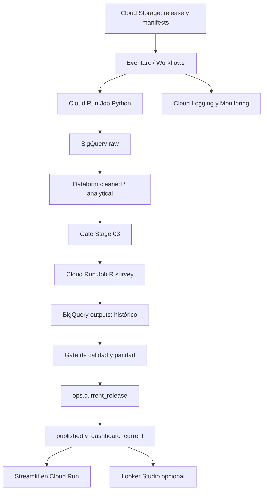

# CRS04 STAGE04 — HOJA ARQUITECTÓNICA DE LA APLICACIÓN DE VIGILANCIA

**Proyecto:** ENARES 2024 CRS04
**Estado:** `SHADOW/PREPARING`
**Issue paraguas:** [#43](https://github.com/ascordero001-cell/enares-2024-crs04-ml/issues/43)
**Documento rector:** [`CRS04_STAGE04_CORREGIDO_VER6_NUEVA_METODOLOGIA.md`](CRS04_STAGE04_CORREGIDO_VER6_NUEVA_METODOLOGIA.md)
**Puerta previa:** [`PRE_STAGE04.md`](PRE_STAGE04.md)
**Mapa de issues:** [`docs/stage04/issue_map.md`](docs/stage04/issue_map.md)

## 1. Alcance

La aplicación presenta exclusivamente resultados agregados y autorizados de los módulos 3.1–3.6.

La aplicación:

- no accede a microdatos;
- no recalcula indicadores;
- no completa valores ausentes;
- no crea desagregaciones nuevas;
- no expone identificadores individuales.

V0 continúa siendo la versión oficial. Stage 04 trabaja en modo shadow hasta que exista una aprobación explícita de promoción y cutover.

## 2. Contrato heredado de Stage 03

| Elemento | Valor aprobado |
|---|---|
| Release candidato | `stage03-v0.5-cloud-full` |
| Tabla autorizada | `enares2024_crs04_outputs.reporting_crs04_survey_input_v0_5` |
| Filas | 18,807 |
| Columnas | 737 |
| IDs | `~ID` |
| Estratos | `~CCDD` |
| Pesos | `~FACTOR_ALUMNOS` |
| Anidamiento | `nest=TRUE` |
| Número de estratos | 25 |
| PSU | 1,115 |
| Grados de libertad | 1,090 |
| `ID_AULA` | Variable de auditoría; no constituye una segunda etapa |
| KD-001 | Resuelta |

Cualquier cambio en este contrato detiene Stage 04 y devuelve el requerimiento a supervisión y Stage 03.

## 3. Arquitectura mínima

Stage 04 comienza en el gate aprobado de Stage 03. No repite la ingesta ni reconstruye los indicadores de etapas anteriores.

## 4. Componentes y responsabilidades

| Componente | Responsabilidad | Estado inicial |
|---|---|---|
| Cloud Storage | Almacenar releases, manifests, hashes y artefactos de recuperación. | Pendiente de autorización |
| Eventarc / Workflows | Detectar releases completos y coordinar el pipeline. | Pendiente de autorización |
| Cloud Run Job Python | Verificar contratos e ingerir candidatos autorizados. | Shadow |
| BigQuery `raw` | Conservar la entrada técnica con acceso restringido. | Restringido |
| Dataform `cleaned` / `analytical` | Ejecutar transformaciones, dependencias y assertions. | Shadow |
| Gate Stage 03 | Confirmar que el release y el contrato metodológico están aprobados. | Aprobado |
| Cloud Run Job R | Ejecutar el diseño survey aprobado sin placeholders. | Shadow |
| BigQuery `outputs` | Conservar el historial inmutable de resultados agregados. | Shadow |
| BigQuery `ops` | Registrar corridas, validaciones, promoción, rollback y release activo. | Shadow |
| BigQuery `published` | Exponer únicamente vistas agregadas autorizadas. | Shadow |
| Streamlit en Cloud Run | Mostrar los módulos 3.1–3.6 mediante acceso read-only. | No desplegado |
| Looker Studio | Servir como contraste institucional opcional. | No bloqueante |
| Cloud Logging / Monitoring | Registrar inicio, fin, errores, duración y estado operativo. | Pendiente |
| GKE | Laboratorio formativo; no forma parte de la arquitectura inicial. | No creado |
| Managed Airflow | Laboratorio o ADR; no reemplaza inicialmente a Workflows. | No creado |
| Agent Engine | Piloto conceptual read-only sobre `ops` y `published`. | No creado |

## 5. Fronteras de seguridad

- La aplicación consulta únicamente `published`.
- La cuenta de servicio de la aplicación tiene acceso read-only.
- Se deniega el acceso a `raw`, `cleaned`, `analytical`, `outputs` y `survey_input`.
- No se utilizan claves JSON locales.
- No se registran microdatos, identificadores personales ni valores sensibles en logs.
- Las exportaciones CSV y Excel contienen únicamente el mismo corte agregado y las mismas supresiones que la aplicación.
- Todo despliegue requiere proyecto, región, presupuesto e IAM previamente aprobados.

## 6. Contratos de publicación

Cada resultado publicado debe conservar como mínimo:

- `release_id`;
- `run_id`;
- módulo e indicador;
- desagregación y categoría;
- estimación e IC95 %;
- CV y N cuando estén autorizados;
- estado de supresión;
- commit de código;
- digest de imagen;
- `source_sha256`;
- estado de validación;
- estado de aprobación.

`ops.current_release` solo puede apuntar a una corrida aprobada.

La vista publicada no reemplaza destructivamente el historial y no expone microdatos ni columnas sensibles.

## 7. Gates de calidad

Antes de promover un release se exige:

1. validación de esquema y contratos;
2. paridad CSV–R–BigQuery;
3. comparación SPSS–R aprobada;
4. prueba golden del corte vertical 3.2;
5. controles aprobados de CV, N e IC95 %;
6. supresión primaria y complementaria;
7. validación de privacidad de las exportaciones;
8. CI verde;
9. revisión independiente;
10. procedimiento de rollback probado.

## 8. Disponibilidad y rollback

La aplicación debe exponer health checks seguros y mostrar el `release_id` activo sin revelar configuración sensible.

Ante un fallo:

1. detener la promoción;
2. conservar el historial;
3. restaurar `ops.current_release` al release aprobado anterior;
4. invalidar la caché por `release_id/run_id`;
5. ejecutar smoke tests;
6. registrar el incidente y su evidencia;
7. documentar la decisión de recuperación.

## 9. Registro de autorización cloud

| Control | Estado |
|---|---|
| Proyecto GCP | `enares-2024-crs04` |
| Ubicación BigQuery | `US` |
| Región operativa propuesta | `us-central1`; despliegue no autorizado |
| Presupuesto máximo autorizado | `USD 0` |
| Responsable de facturación | `PENDIENTE/NO ASIGNADO`; bloqueante |
| Responsable IAM | `PENDIENTE/NO ASIGNADO`; bloqueante |
| Cuenta de servicio prevista | `sa-enares-app-reader@enares-2024-crs04.iam.gserviceaccount.com`; no creada |
| Estado cloud | `NOT_AUTHORIZED` |
| URL `*.run.app` | No creada |
| Publicación institucional | No autorizada |
| Cutover | No autorizado |

Con presupuesto autorizado de `USD 0` y sin responsables de facturación o IAM, queda prohibido
crear recursos, cuentas de servicio, bindings IAM, buckets, Cloud Run, GKE, Airflow, Agent Engine
o despliegues cloud. Se puede continuar preparando código, tests, contratos y diseño local. Esta
condición mantiene la decisión general en `NOT_READY` hasta que se registren responsables reales
o una alternativa formalmente aprobada.

### Alternativa local propuesta

Se propone `LOCAL SHADOW ONLY`, con Ana Silvia Cordero Ricaldi como responsable del desarrollo
local y `ritaricaldi-cpu` como revisora metodológica y de privacidad. En esta fase, facturación e
IAM se registran como `NO APLICA EN FASE LOCAL; pendiente antes de cloud`; el presupuesto sigue
en `USD 0` y cloud en `NOT_AUTHORIZED`. La propuesta está pendiente de aprobación explícita en
PR #53 y, mientras tanto, no cambia la decisión `NOT_READY` ni autoriza recursos o despliegues.
