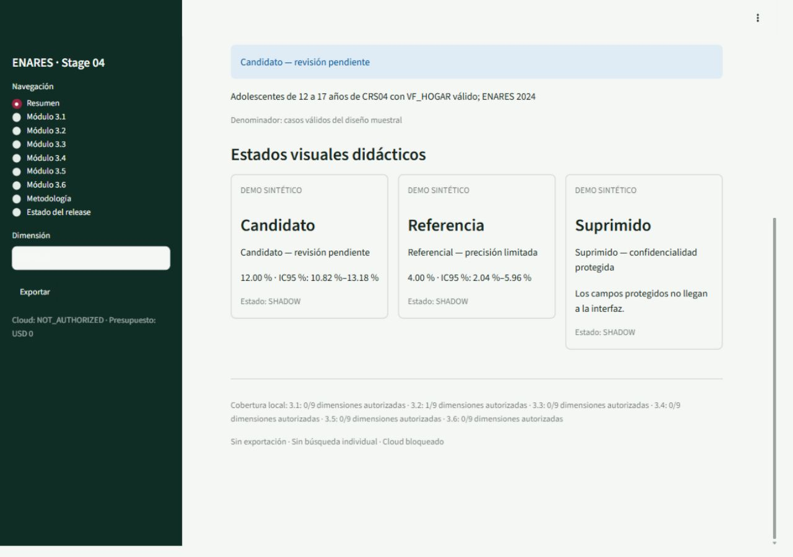

# ENARES 2024 CRS04 — pipeline reproducible y vigilancia poblacional

[](https://github.com/ascordero001-cell/enares-2024-crs04-ml/actions/workflows/ci.yml)


Proyecto técnico para procesar de forma reproducible y auditable el Cuestionario 4 de
ENARES 2024 —adolescentes de 12 a 17 años— y desarrollar una interfaz de vigilancia
poblacional basada únicamente en agregados validados.

> **Estado real:** V0 continúa siendo la versión oficial. V0.5 permanece en
> `SHADOW — NOT PUBLISHED`. PRE-STAGE04 está cerrado y el checkpoint de ingeniería
> local del Corte 2 fue aprobado y fusionado mediante el [PR #57](https://github.com/ascordero001-cell/enares-2024-crs04-ml/pull/57).
> Sprint 04.2 sigue en curso. Las 3,014 filas del catálogo V0 están conectadas y reconciliadas para
> `LOCAL_SHADOW_ONLY`. El vínculo de facturación y el presupuesto conservador equivalente a menos
> de USD 20 fueron configurados; el gasto objetivo es USD 0. El canal de alertas y los tres roles
> de lectura de Rita también están configurados y verificados privadamente. La creación de
> recursos y la conexión de cifras reales esperan la decisión separada del paso 47. Todavía no se
> autoriza publicación ni cutover.



*Captura de un fixture sintético en shadow. No contiene filas ni datos individuales.*

## Qué está disponible y qué no

| Capa | Cobertura verificable | Significado |
|---|---:|---|
| Catálogo V0 autorizado para implementación local | 516 indicadores / 3,014 filas agregadas | Decisión supervisora registrada; implementación pendiente |
| Registro de navegación de la app | 7 `indicator_id` seleccionados en 3.1–3.6 | Configuración técnica y comportamiento fail-closed |
| Resultados V0 conectados | 52 filas en los módulos 3.1–3.6 | Agregados locales ligados a manifiestos; no publicados |
| Demo visual | candidato, referencial y suprimido | Fixture 100 % sintético, separado de V0 |

Las 2,962 filas restantes están autorizadas pero todavía no conectadas. La implementación debe
crear un extracto y manifiesto nuevos, probar rederivación y mantener una navegación utilizable;
ninguna autorización permite inventar dimensiones o cruces ausentes de V0.

La exportación técnica del mismo corte agregado V0 visible está habilitada en CSV y Excel con
controles contra fórmulas y metadata. No están autorizados la publicación institucional,
promoción, cutover, sustitución de V0, autenticación cloud, cambios IAM ni despliegues.

## Estado del proyecto

| Stage | Alcance | Estado |
|---|---|---|
| Stage 01 | Ingesta y preservación de fuentes | Aprobado |
| Stage 02 | Almacenamiento y validación inicial | Aprobado |
| Stage 03 | Limpieza, indicadores 3.1–3.6 y migración por componentes | `PASS` en shadow |
| PRE-STAGE04 | Inventario, gobernanza y autorización local | `CLOSED/PASS` |
| Stage 04 | Aplicación de vigilancia poblacional | `LOCAL_SHADOW_ONLY`; Sprint 04.2 en curso |
| Stage 05 | Evaluación y decisiones posteriores | Pendiente |

### Versiones

- **V0:** implementación histórica y versión oficial preservada por manifiestos y hashes.
- **V0.5:** migración validada por componentes; permanece en shadow y no sustituye V0.
- **V1:** versión futura, no terminada ni aprobada; requiere una decisión independiente de
  promoción y cutover.

Un `PASS` técnico o metodológico no equivale a autorización de publicación institucional.

## Módulos de vigilancia

| Módulo | Contenido | Filas V0 autorizadas | Filas conectadas localmente |
|---|---|---:|---:|
| 3.1 | Características, percepciones y normas | 1.170 | 10 |
| 3.2 | Violencia psicológica y física en el hogar | 389 | 1 |
| 3.3 | Violencia psicológica y física en la escuela | 123 | 1 |
| 3.4 | Violencia sexual | 749 | 1 |
| 3.5 | Polivictimización y acumulación de violencias | 457 | 38 |
| 3.6 | Búsqueda de ayuda | 126 | 1 |

Las 3.014 filas están autorizadas únicamente para implementación local en shadow; 52 están
conectadas. La conexión cloud y la publicación de resultados continúan sin autorización.

La etiqueta 3.1 no cambia el significado original de sus indicadores. El bloque oficial 3.6
corresponde a **Búsqueda de ayuda**; las denominaciones históricas se conservan únicamente para
trazabilidad.

## Arquitectura actual

```text
Fuentes institucionales preservadas por hash
  -> Stage 01: ingesta y manifiestos
  -> Stage 02: capa raw
  -> Stage 03: capas cleaned y analytical 3.1–3.6
  -> agregados y contratos V0/V0.5 validados
  -> repositorio local de agregados autorizados
  -> validación de módulo + indicador + authorized_dimensions
  -> aplicación Streamlit local, read-only y fail-closed
```

La aplicación no consulta microdatos ni permite buscar niñas, niños o adolescentes individuales.
Las capas `published/current`, BigQuery adicional y Cloud Run pertenecen a gates futuros que no
están autorizados en esta fase.

## Reproducibilidad y evidencia

- La baseline V0 está identificada por archivos, tamaños y SHA-256 en el
  [inventario aprobado](CRS04_STAGE04_VERSION_0_REGISTRO.md).
- El cierre de Stage 03 y la comparación histórica 3,013/3,014 están documentados en el
  [reporte de cierre](docs/stage03/stage3_closure_report.md) y sus
  [discrepancias conocidas](docs/stage03/known_discrepancies.md). Esa comparación no implica
  paridad completa ni autoriza automáticamente el catálogo de Stage 04.
- La conciliación de 516 indicadores / 3,014 filas está separada de la cobertura visible en la
  [conciliación 3.1–3.6](docs/stage04/reconciliation_modules_31_36.md).
- El golden local autorizado de 3.2 conserva su archivo y hash aprobados; Stage 04 no reconstruye
  los indicadores de Stage 03 desde microdatos.
- `N no ponderado` procede exclusivamente de `base_unw`; `target_unw` representa el objetivo
  y no se usa como sustituto.

## Quick Start — Windows PowerShell

### Requisitos

- Git;
- Python 3.12;
- Node.js 22;
- Dataform CLI 3.0.64.

Desde la raíz del repositorio:

```powershell
git clone https://github.com/ascordero001-cell/enares-2024-crs04-ml.git
cd enares-2024-crs04-ml
py -3.12 -m venv .venv
.\.venv\Scripts\Activate.ps1
python -m pip install --upgrade pip
python -m pip install -r requirements-dev.txt
python -m pip install ruff nbqa
python -m compileall -q src scripts tests
nbqa ruff notebooks/
python -m pytest tests/test_naming.py -q
python -m pytest -q
npm install --global @dataform/cli@3.0.64
dataform compile dataform
python -m streamlit run app/streamlit_app.py
```

Si el lanzador `py` no está instalado, confirma primero que `python --version` sea 3.12 y usa
`python -m venv .venv`. Esa variante equivalente fue la utilizada para verificar el entorno
limpio en Windows.

Streamlit mostrará la URL local en la terminal. Para detener el servidor, vuelve a esa terminal
y presiona `Ctrl+C`.

El lint de notebooks está configurado en CI como control **informativo y no bloqueante**; puede
reportar observaciones. `pytest` y la compilación Dataform sí son bloqueantes. El workflow vigente
ejecuta además:

```powershell
python -m compileall -q src scripts tests
nbqa ruff notebooks/
python -m pytest
dataform compile dataform
```

No se incluyen comandos de `gcloud`, autenticación ni despliegue porque requieren autorización
específica de facturación, IAM, presupuesto y rollback.

## Mapa del repositorio

```text
enares-2024-crs04-ml/
├── .github/workflows/       # CI
├── app/                     # Aplicación Streamlit local
├── configs/                 # Configuración y skip logic
├── dataform/definitions/    # Sources, cleaned, analytical, assertions, reporting y ops
├── docs/adr/                # Decisiones arquitectónicas
├── docs/stage03/            # Contratos y cierre de Stage 03
├── docs/stage04/            # Contratos, conciliación y evidencia de Stage 04
├── notebooks/               # Notebooks reproducibles
├── scripts/                 # Generadores y utilidades
├── src/enares/              # Código Python modular
└── tests/                   # Pruebas sintéticas, de contrato y de aplicación
```

## Documentación principal

- [Estado único de Stage 04 — 2026-09-15](docs/stage04/stage04_documento_unico_20260915.md)
- [PRE-STAGE04](PRE_STAGE04.md) · [Documento rector](CRS04_STAGE04_CORREGIDO_VER6_NUEVA_METODOLOGIA.md) · [Hoja arquitectónica](CRS04_STAGE04_HOJA_ARQUITECTONICA_APP_VIGILANCIA.md)
- [Mapa real de issues](docs/stage04/issue_map.md) · [Issue paraguas #43](https://github.com/ascordero001-cell/enares-2024-crs04-ml/issues/43)
- [Checkpoint Corte 2](docs/stage04/sprint042_corte2_module_coverage.md) · [Matriz de cobertura](docs/stage04/module_coverage_matrix.md) · [Evidencia HCI](docs/stage04/hci_accessibility_corte2.md)
- [Contrato de estimaciones](docs/contracts/indicator_estimates_contract.md) · [Contrato de exportación](docs/contracts/export_contract.md) · [Discrepancias Stage 04](docs/stage04/known_discrepancies.md)
- [Stage 03 PASS](docs/stage03/stage3_pass.md) · [Handoff a Stage 04](docs/stage03/stage04_handoff.md) · [Guía de contribución](CONTRIBUTING.md)

## Privacidad y uso responsable

Este repositorio público contiene código, contratos, fixtures sintéticos y evidencia agregada.
No contiene archivos `.sav`, microdatos, filas individuales, identificadores personales,
credenciales, tokens, archivos `.env`, llaves de cuentas de servicio, rutas privadas ni IDs
internos de Drive. Los archivos restringidos permanecen en ubicaciones privadas autorizadas.

La interfaz es un prototipo técnico y no una publicación institucional. El proyecto no afirma
respaldo formal de University of Sussex, INEI, UNICEF ni de otra institución. Cualquier uso
institucional requiere revisión, autorización y gobernanza adicionales.

## Contribución

El flujo esperado es:

```text
Issue -> rama -> commits pequeños -> pull request -> CI -> revisión independiente -> merge
```

Consulta [CONTRIBUTING.md](CONTRIBUTING.md). Cambios de universos, denominadores, recodes,
diseño muestral, calidad, supresión o publicación requieren revisión independiente.

Autora: **Ana Silvia Cordero Ricaldi**. Proyecto técnico y formativo desarrollado de manera
independiente.
