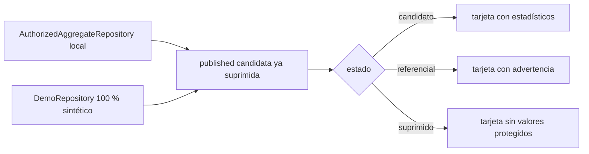

# Wireframe local — vigilancia poblacional 3.2

- Estado del artefacto: `LOCAL_SHADOW_ONLY`
- Fuente de la tarjeta principal: agregado V0 autorizado por hash
- Fuente de estados alternativos: fixture totalmente sintético
- Conexiones: ninguna; sin Drive, BigQuery ni servicios cloud

## Estado con dato candidato

```text
┌──────────────────────────────────────────────────────────────────────────┐
│ VIGILANCIA POBLACIONAL — ENARES CRS04                  [SHADOW]          │
│ Módulo 3.2 · Violencia en el hogar                                       │
├──────────────────────────────────────────────────────────────────────────┤
│ Indicador: VF_HOGAR             Desagregación: Nacional · Total          │
│                                                                          │
│  16.74 %                                                                 │
│  IC95 %: 15.74 %–17.75 %     CV: 0.03055     N no ponderado: 18,807    │
│  Estado: PUBLISHABLE_CANDIDATE                                           │
├──────────────────────────────────────────────────────────────────────────┤
│ Universo: adolescentes de 12–17 años de CRS04 con VF_HOGAR válido       │
│ Periodo: ENARES 2024                                                     │
│ Denominador: casos válidos del diseño muestral                           │
│ Release: enares2024-crs04-v0-shadow-001                                  │
│ Fuente: v0_official_drive_baseline · engine: v0_csv                      │
│ Actualización del prototipo: 2026-09-04 UTC                              │
├──────────────────────────────────────────────────────────────────────────┤
│ Nota: estimación agregada en revisión; no es publicación institucional. │
└──────────────────────────────────────────────────────────────────────────┘
```

## Estados alternativos

| Estado | Comportamiento del wireframe |
|---|---|
| Carga | Esqueleto sin valores y texto “Cargando resultado agregado…” |
| Sin datos | “No existe una fila aprobada para esta combinación”; no muestra cero |
| Error | Mensaje genérico, ID técnico de evento y ningún dato/configuración sensible |
| Referencial | Muestra estimate, IC95 %, CV y N con advertencia “estimación imprecisa”; no habilita ranking |
| Suprimido | Muestra “Suprimido para proteger confidencialidad”; estimate, IC95 %, CV y N no llegan desde published |
| Sintético | Banda visible “DATOS TOTALMENTE SINTÉTICOS — NO USO INSTITUCIONAL” |

## Flujo



El futuro consumidor recibe la misma firma de `IndicatorRepository`; no sabe abrir CSV privados
ni acceder a microdatos. Este wireframe no es una aplicación completa, no incluye búsqueda de
personas, mapas, rankings, despliegue ni URL pública.
