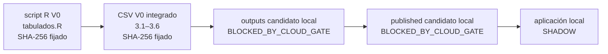

# Inventario reproducible de la baseline V0

**Estado:** `PUERTA_B_REVIEW_REQUESTED`  
**Alcance:** `LOCAL_SHADOW_ONLY`  
**Cloud:** `NOT_AUTHORIZED`  
**Fuente:** lectura directa de los objetos privados de Drive; no se usaron copias locales como autoridad  
**Baseline aprobada:** manifiesto contrastado el `2026-09-03T00:31:07Z`  
**Release aprobado de Stage 03:** `stage03-v0.5-cloud-full`

Este archivo solo contiene metadatos agregados. No contiene microdatos, archivos `.sav`, rutas
personales, identificadores internos de Drive, enlaces públicos ni credenciales. Los originales no
se movieron, renombraron ni sobrescribieron. La baseline exacta continúa fijada por
`docs/stage04/v0_drive_hash_manifest.md`.

## Objetos V0 oficiales

| Rol | Nombre real | Nombre lógico | Ubicación lógica privada | Filas / tamaño | Escala | SHA-256 |
|---|---|---|---|---|---|---|
| Productor R | `tabulados.R` | `tabulados_crs04_v0.R` | `ENARES_2024_PROJECT/03Scripts_R` | 19,864 bytes | No aplica | `A45A73F40D728713A52800653991EBDBFF4E80A0D9A6A8318E8D7BD266597C1D` |
| Salida integrada | `tabulados_crs04_long.csv` | `tabulados_crs04_long_v0.csv` | `ENARES_2024_PROJECT/04Outputs` | 3,014 filas; 576,919 bytes | porcentaje y error en puntos porcentuales, `0–100` | `15B845DA4A886FDCF54A96D8B8471B6F6BE618AE18B43024488C6BD6B23D0BB4` |
| Diseño | `design_crs04.rds` | `design_crs04.rds` | `ENARES_2024_PROJECT/04Outputs` | 6,166,714 bytes | No aplica | `C9C7D96F053BE17606C9BDCED365ECC5E0016FF0294958E378CC62C747F46965` |
| Diccionario | `diccionario_indicadores.csv` | `diccionario_indicadores.csv` | `ENARES_2024_PROJECT/04Outputs` | 516 filas; 354,668 bytes | Declara la escala por `statistic_type` y las reglas de cálculo | `F5FD6979A19EBC9F510C307705B1E7DE12556A8F5A81DDBC566E97347337BD2C` |

El CSV V0 es un único objeto integrado, no seis CSV independientes. El inventario siguiente lo
segmenta lógicamente por el campo `module` del diccionario, sin duplicar ni alterar sus bytes.
El CSV no incorpora una columna `release_id`; por ello no se le atribuye uno retroactivamente.
La asociación registrada es: baseline `V0 oficial` contrastada por hash y, por separado, handoff
de diseño aprobado de Stage 03 `stage03-v0.5-cloud-full`.

## Cobertura lógica 3.1–3.6

| Módulo | Filas V0 | Indicadores | Centinela de inventario | Desagregaciones observadas |
|---|---:|---:|---|---|
| 3.1 Características y percepciones | 1,170 | 100 | `AG_VF_09` | Nacional, Departamento, Discapacidad, Etnicidad, Lengua materna, Sexo, Tipo de hogar, Área, Área y sexo y dimensiones temáticas autorizadas |
| 3.2 Violencia en el hogar | 389 | 28 | `VF_HOGAR` | Nacional, Departamento, Discapacidad, Etnicidad, Lengua materna, Sexo, Tipo de hogar, Área, Área y sexo y dimensiones temáticas autorizadas |
| 3.3 Violencia en la escuela | 123 | 29 | `C3P223_10_1` | Nacional, Departamento, Discapacidad, Etnicidad, Lengua materna, Sexo, Tipo de hogar, Área y Área y sexo |
| 3.4 Violencia sexual | 749 | 212 | `Agresor_VS_12M__AG_01` | Nacional y desagregaciones autorizadas en el diccionario; cada universo específico debe respetarse |
| 3.5 Consecuencias y acumulación | 457 | 21 | `CONS_ATENCION_SALUD` | Nacional, Departamento cuando está autorizado, dimensiones globales y cruces especiales registrados |
| 3.6 Búsqueda de ayuda | 126 | 126 | `C3P213` | Nacional |

Las 3,014 filas se conciliaron una a una con las 516 especificaciones del diccionario: no quedó
ningún `indicator_id` sin correspondencia. Esta conciliación verifica cobertura, no aprueba por sí
misma cada combinación para publicación.

## Universo, periodo y diseño heredado

- Población marco: CRS04, adolescentes de 12 a 17 años.
- Periodo: ENARES 2024.
- Universo particular: el declarado por cada fila del diccionario mediante numerador,
  denominador, dominio, missing y dimensiones. No se generaliza un universo único cuando el
  contrato define uno específico.
- Diseño aprobado de Stage 03: `ids = ID`, `strata = CCDD`,
  `weights = FACTOR_ALUMNOS`, `nest = TRUE`; 25 estratos, 1,115 PSU y 1,090 grados de libertad.
- `ID_AULA` se conserva solo para auditoría. No se reconstruye como segunda etapa del diseño.
- Stage 04 no recalcula indicadores desde microdatos: usa la salida agregada V0 y el contrato
  aprobado.

## Trazabilidad local y límite cloud

`outputs` y `published` son destinos contractuales candidatos, no recursos creados ni una
comparación CSV–BigQuery ejecutada. Toda creación o carga cloud permanece
`BLOCKED_BY_CLOUD_GATE`.

## Separación de versiones y preservación

- V0 continúa oficial y queda identificada por los cuatro hashes anteriores.
- V0.5 permanece exclusivamente en shadow y conserva hashes, carpetas y productores separados
  en `v0_drive_hash_manifest.md`.
- `CRS04_Stage04_CORREGIDO_ver5` y cualquier script/CSV previo que exista en la custodia privada
  no se modifica ni se borra. Ese artefacto no está presente en este checkout y no se creó una
  copia para evitar introducir una versión no contrastada.
- Cualquier cambio posterior exige una nueva versión y un manifiesto nuevo; nunca se sobrescribe
  esta baseline.

## Controles y preguntas para supervisión

- Confirmado: escala del CSV, cobertura 3.1–3.6, correspondencia completa con el diccionario,
  release aprobado de Stage 03 y diseño muestral.
- Pendiente de aprobación metodológica: regla institucional de calidad/supresión. Los umbrales
  `CV > 0.15` y `N < 30` solo se usan como ejercicios provisionales en el checklist.
- Pendiente de una fase posterior: contratos locales, golden test, seguridad, wireframe y toda
  actividad cloud. No se avanzará a ellos antes de resolver la PUERTA B.

